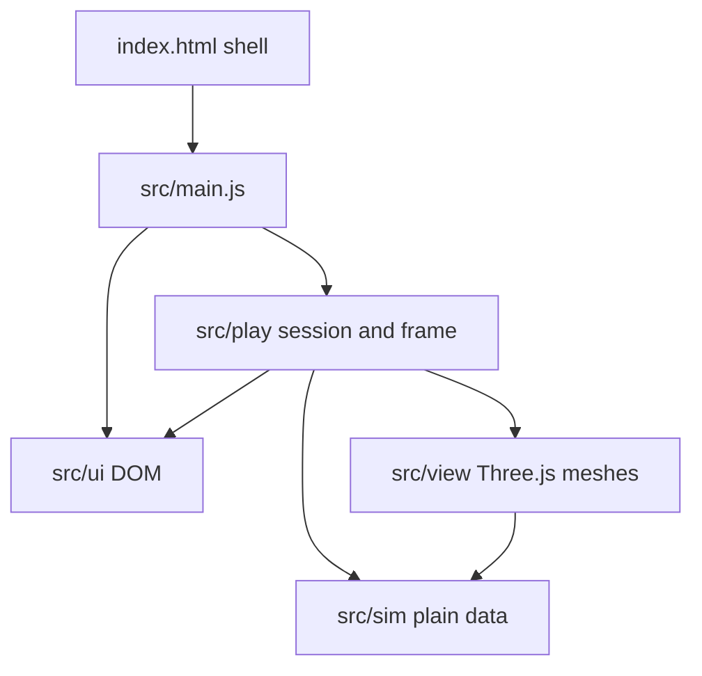
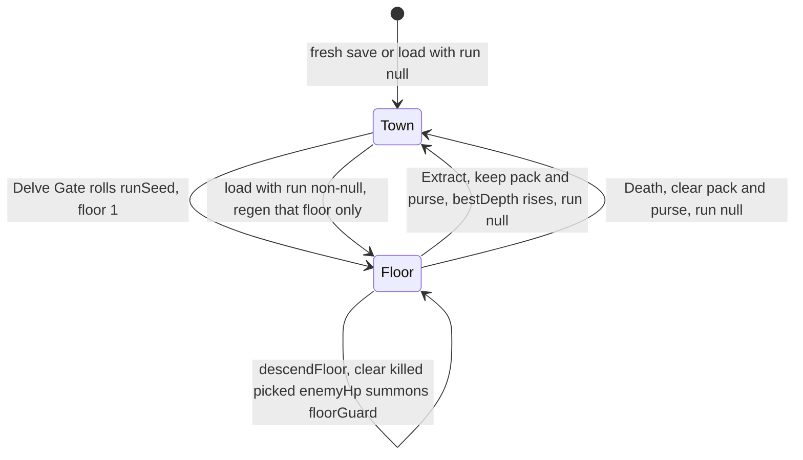
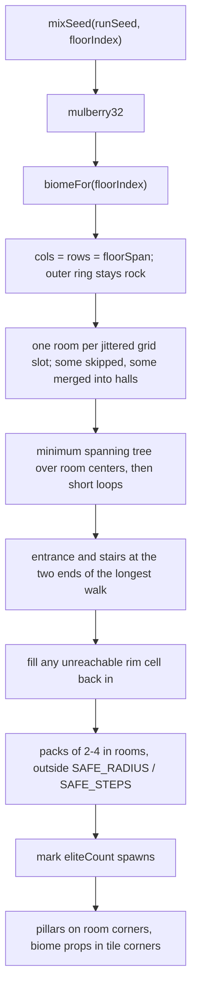
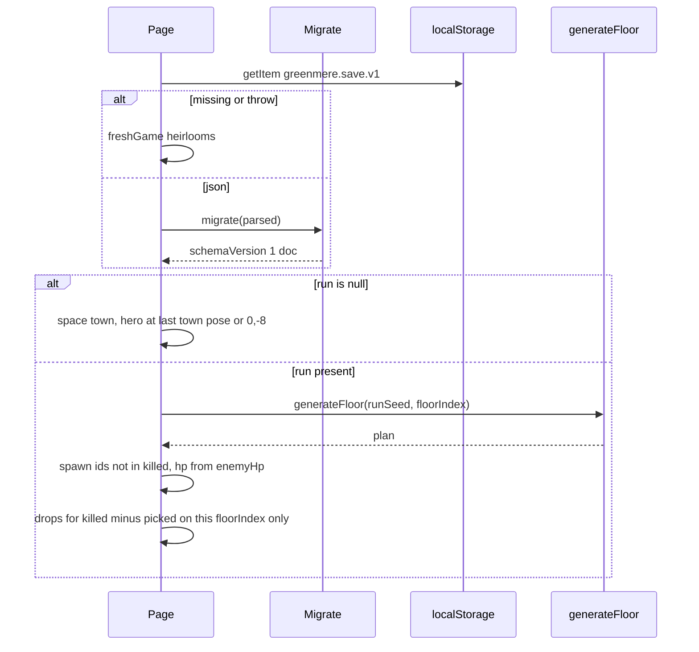

# Greenmere — Town Hub and Endless Delve

| | |
|---|---|
| Author | Design |
| Date | 2026-10-01 |
| Status | Draft |
| Product | Greenmere — The Outer Wood (working title) |
| Source of truth | `D:\ArBe-Projects\game\index.html` |
| Art direction | `C:\Users\RJBri\.grok\memory-v2\workspaces\game-89cedae4\topics\greenmere-style.md` |
| Spatial frame | `C:\Users\RJBri\.grok\bundled\skills\threejs-frame-conventions\SKILL.md` |

> **Town update (2026-10-01):** the hub is now a life-size, walk-in town with townsfolk. `docs/town-living.md` §8 lists the items here that it supersedes (HUB-02 positions, the arrival point, "no interiors", the meadow radius, and where draughts are crafted).

This document is the game-design and engineering spec for the first playable loop: a safe town on the existing meadow, and an endless seeded dungeon under it. An engineer should be able to implement milestones M1–M5 from the rules below without inventing combat math, loot, or the save schema.

## Overview

Greenmere today is a single-file Three.js r183 walking prototype. The player is the stocky blue-and-gold Warden, moving with camera-relative WASD on a 400-unit Outer Wood (`WORLD`, `terrainHeight`, 3,050 instanced trees). The HUD already speaks in dark-wood plaques and an eight-slot action bar, but Strike, Ward, and Mend do not touch a world: there are no enemies, no inventory, and no second space.

The long-term game is a Torchlight-style loop, not a genre change. The meadow becomes the town of Greenmere. A north gate opens **The Underwood**, a procedural dungeon with no last floor. Each floor is a pure function of `(runSeed, floorIndex)`. The player kills, loots, descends or extracts, and spends the haul at a smith, a trainer, and a general store. Death drops what was carried and leaves what was stashed. The existing orbit camera and camera-relative movement stay; they are already proven by `selfTestControls`.

The visual contract does not move. Flat shading, `MeshLambertMaterial` for the world, `MeshStandardMaterial` for the hero, `NoToneMapping`, warm sun `#ffd7a4`, and `FogExp2` horizon `#d5e4b8` stay. The dungeon is new geometry in that same language, not a second art style.

## Background and Motivation

### Current state

The playable page is `index.html`: an import map to `three@0.183.2/build/three.module.min.js`, one module script, no build step. These are the load-bearing pieces:

| Piece | Where | Behavior to keep |
|---|---|---|
| RNG | `mulberry32`, global `rand = mulberry32(0x6e11e5)` | Town scatter only. Dungeon code must not advance this stream. |
| Terrain | `terrainHeight`, `hash2`, `WORLD = 400`, `HALF` | Rolling hills, meadow flattened between distance 12 and 30, rim past 0.84 of `HALF`. |
| Forest | `TREE_COUNT = 3050`, `stampInstances`, `TREE_GAP` | Do not thin the forest to make room for the dungeon. The meadow inside radius 14 is already clear of the main scatter. |
| Collision | `CELL = 8`, `addCollider`, `resolveColliders` | Circle push on XZ. Hero radius `0.42`. |
| Camera | `camYaw`, `camPitch`, `camDist`, `placeCamera`, `cameraPlanarBasis` | Orbit. Movement basis is read from `camera.getWorldDirection` every frame. `forward × up = right`. |
| Facing | `update` | Local forward is −z. Travel yaw is `Math.atan2(-wish.x, -wish.z)` via `dampAngle`. |
| Grounding | `groundY` | Ray down at the terrain mesh, fallback `terrainHeight`. Feet sit on the mesh. |
| Hero | `player` group, `nose`, `toe` | Code-built. `modelFront()` uses the nose, not the parent −z, as the self-test oracle. |
| HUD | plaques, `abilities`, `tryAbility`, `vitals`, `resetHud` | Eight slots. Mend heals 22 for 14 mana after a 1.5 s cast, with no cooldown. `resetHud()` (called at startup) sets current pools to **126 HP and 48 mana** and maxima to 160 and 80. It does not fill the bars. The self-test never asserts those current values; it assigns `vitals` itself before Mend. |
| Frame cap | `frame` | `dt = Math.min(0.033, …)`. Pixel ratio capped at 1.75. |
| Test | `?test=1`, `window.__selfTestControls` | Movement, facing, nose, fog, `flatShading`, minimap axes, Mend. |

`paintFaces` and `mergeParts` are the mesh factories. `lambert()` is `MeshLambertMaterial` with `vertexColors` and `flatShading: true`. The hero uses `makeMat` → `MeshStandardMaterial`, still flat, metal only on gold and steel. The renderer sets `NoToneMapping` and `SRGBColorSpace`. Fog is `FogExp2(0xd5e4b8, 0.0105)`. The sun is a directional light, color `0xffd7a4`, direction about `(-0.48, 0.86, 0.28)`, 2048 shadow map, ortho frustum ±34. The campfire sits at `(3.4, -2.6)` with one point light (intensity ~8, distance 9, decay 2). Terrain is a `PlaneGeometry` with `rotation.x = -Math.PI / 2`, so the walk plane is world XZ and the geometric normal is +Y.

The action bar is flavor plus resource checks. That is the right hook for combat, not something to replace with a click-to-move UI.

### Pain points

- There is no loop. The player can walk, spend mana, and reset.
- Loot, skills, and crafting have nowhere to live, so a dungeon would drop numbers into the void.
- The file is already ~1,850 lines. A dungeon pasted under `update` with no pure functions will make `?test=1` the only test and will couple floor layout to the town RNG.
- A naive indoor mesh will be invisible from inside: Three.js `FrontSide` boxes cull their inner faces (frame-conventions Rule 2). A camera boom that only raycasts `terrain` will sit inside dungeon walls.

### Why this shape

Torchlight's fantasy is "one more floor" with a town between runs. The prototype's fantasy is the Outer Wood and this specific Warden. The design joins them by adding a second space, not by replacing the third-person walk with an isometric action-RPG control scheme.

## Goals and Non-Goals

### Goals

- Two spaces: **Town** (the current Outer Wood, with hand-placed stations on the meadow) and **Dungeon** (The Underwood, one generated floor at a time).
- A real-time melee loop on the existing control scheme: basic Strike plus Ward and Mend.
- One hero, the current Warden, with numeric skill ranks and a three-stat combat model.
- Identified gear, a 24-slot pack, a 48-slot stash, four crafting materials, and a smith upgrade that raises item level without rerolling affixes.
- Endless floors. Difficulty, density, and loot quality are closed-form functions of `floorIndex`. Same `(runSeed, floorIndex)` always rebuilds the same plan.
- Local versioned save. No accounts and no server.
- Art direction unchanged. New meshes are code-built, flat-shaded, and untextured.
- `?test=1` still passes, extended with pure tests for generation, balance, damage, and save migration.

### Non-goals

- Click-to-move, isometric camera, or a second control scheme.
- Multiplayer, accounts, cloud saves, anti-cheat, analytics.
- A second playable class, pets, or a skill tree UI beyond four tracks.
- Town construction (raising stalls or houses). The phrase "build goods" means crafting. A `stall` flag is reserved and stays false.
- Item durability, unidentified items, gambling, or enchant rerolls.
- Downloaded models, photo textures, smooth shading, ACES, or a glTF pipeline.
- Skeletal animation. Attacks are procedural rotations, as the walk cycle already is.
- Audio.
- A bundler, TypeScript, or a backend. The app is native ES modules from PR-00. A bundler waits until a second runtime dependency or a measured load problem.
- Pause-to-order tactics, companion AI, or destructible town props.
- A fixed campaign of N hand-authored floors.

## Requirements

Each requirement has a stable ID, a statement, acceptance criteria, and the first PR that delivers it. PR titles are in the PR Plan. Milestones: **M0** is the prototype as it stands. **M1** is the module shell plus the loop (PR-00–PR-03). **M2** is persistence and the store (PR-04–PR-05). **M3** is loot and skills (PR-06–PR-07). **M4** is crafting and the real threat curve (PR-08–PR-09). **M5** is themes and hardening (PR-10–PR-11).

### Town

**HUB-01. The town is the current Outer Wood, and it is safe.**
Statement: Town uses the existing scene, `terrainHeight`, camp, and 3,050 trees. No enemy is spawned there, and no ability damages the player or a prop.
Acceptance: With `space === "town"`, HP does not change from Strike, Ward, or a hostile test actor. `TREE_COUNT` is still 3,050 and `pines.length + decs.length === 3050`. The camp remains at `(3.4, -2.6)`.
First delivered: PR-02 (M1).

**HUB-02. Five stations stand on the meadow.**
Statement: Hand-placed, code-built stations exist at fixed XZ: Hearth `(3.4, -2.6)`, Bramble & Board (store) `(-6.5, 2.5)`, The Quench (smith) `(6.2, 3.4)`, The Circle (trainer) `(0.5, 7.5)`, Delve Gate `(0, -11)`. Each has a collider and an interact radius of 2.4. The gate's descent trigger is a 1.8 radius on the gate's south side `(0, -9.2)`.
Acceptance: Positions are constants, not `rand()`. A `?test=1` check resolves `terrainHeight` under each station and asserts the mesh's feet are within 0.05 of `groundY`. Walking into a station collider does not tunnel the hero through it (`resolveColliders`, radius 0.42).
First delivered: PR-02 (M1). Props only; panels land in later PRs.

**HUB-03. Interaction opens one plaque, never a centered card.**
Statement: Inside a station radius, the cast line reads `F — {station}`. F or a click on the prompt opens one side plaque (`#panel`) and closes any other. Escape or walking past 3.2 m closes it. Town time is not frozen.
Acceptance: The panel uses the existing plaque gradient, gold hairline `#e2ba60`, Palatino, parchment `#f4e7c8` / `#e7d7b4`. It is anchored under the vitals plaque or under the minimap, width ≤ 380 px, not `transform`ed to the viewport center. `textContent` / DOM APIs only; station copy is never `innerHTML`.
First delivered: PR-05 for the store panel shell; smith and trainer content in PR-07 and PR-08. The F prompt itself is PR-02.

**HUB-04. The store makes loot and supplies matter.**
Statement: Bramble & Board buys pack gear at 30% of vendor value, sells health draughts and mana draughts at 25 gold, and moves items between pack and stash and gold between purse and bank. The session remembers the last 8 sales for buyback and does not write buyback into the save.
Acceptance: Selling a listed item increases purse by `floor(vendor/10*3)` using integer math in the Data Model. Buying with a short purse shakes the slot (`deny`) and does not change the pack. Deposit of 40 gold moves 40 from purse to bank. Stash cannot exceed 48 gear slots.
First delivered: PR-05 (M2).

**HUB-05. The smith crafts goods and upgrades items.**
Statement: The Quench runs the recipe table and the +1 item-level upgrade. Output that is gear needs a free pack slot; output that is a draught stacks. Upgrade does not change affix ids or their roll `t`.
Acceptance: The four v1 recipes in the Data Model consume the listed materials and gold and emit the listed counts. With `bestDepth >= 2`, upgrading an ilvl-1 heirloom blade (`themeId` 0) costs 56 gold and 2 heartwood and yields ilvl 2 with the same `affixes[].id` and `t`. The same upgrade is refused when `bestDepth` is 0 or 1, when `ilvl + 1 > bestDepth`, or when the cost is short. A floor-1 extract (`bestDepth === 1`) does not unlock it.
First delivered: PR-08 (M4).

**HUB-06. The trainer spends skill points on four tracks.**
Statement: The Circle shows Edge, Bulwark, Mend, and Delver, the unspent point count, and a single "raise" control per track. A raise increments that rank by 1 and decrements `skillPoints`, and it is refused at rank 5 or at 0 points.
Acceptance: After one raise of Edge, `tracks.edge === 1` and Strike's damage multiplier is 1.12. Ranks persist across a save round-trip. No second point currency exists.
First delivered: PR-07 (M3).

**HUB-07. The Delve Gate starts a run and is the only town exit.**
Statement: Using the gate in town with no active run rolls `runSeed` from `performance.now()` mixed with one `Math.random()` call **outside** `generateFloor`, sets `floorIndex = 1`, and loads that floor. There is no other transition into the dungeon.
Acceptance: Two gate uses without an injected seed produce two runs (seeds may collide only by chance; tests inject seeds and do not assert uniqueness). `generateFloor` itself contains no `Math.random` and does not read the global `rand`.
First delivered: PR-03 (M1).

**HUB-08. Town construction is not in v1.**
Statement: `townUnlocks.stall` exists and remains false. No UI offers to place a building. "Build goods" is crafting only.
Acceptance: A test loads a fixture with `stall: false`, runs migrate, and asserts it is still false. No button label contains "raise" except skill ranks.
First delivered: PR-04 (M2) writes the flag; PR-08 must not add a stall UI.

**HUB-09. Entering town refills combat pools and clears dungeon transients.**
Statement: Extract and death both call `arriveTown`. That sets `space = "town"`, places the hero at `(0, -8)` with `rotation.y = 0` (facing the gate, local −z), sets current HP and mana to their maxima (not to the prototype's wounded 126 / 48), clears Ward absorb, Sunder, and the extract channel, disposes the dungeon root, calls `applyTownLight()`, and sets `run` to `null`. The pack, purse, and `bestDepth` edits for the reason happen first, while `run.floorIndex` is still readable, and `run = null` happens before any `setItem`. A later load of that document must take the town path in the state diagram, not the resume path.
Acceptance: Arrival from a floor at 1 HP ends at full HP at `(0, -8)` within 0.05, yaw 0, and `dungeonRoot` has no parent. Equipped items are unchanged. After either reason, `run === null`. Saving that document and loading it spawns in town, not on the floor just left.
First delivered: PR-03 (M1).

### Dungeon

**DUN-01. Exactly one space is in the rendered scene graph.**
Statement: `townRoot` and `dungeonRoot` are not both parented to the scene. The inactive root is removed, not merely `visible = false`, so the town's 3,050 trees are not raycast or shadow-tested during a floor. Unparenting is not enough by itself: `Raycaster.intersectObject` still hits an object with no parent, and today's `groundY` / `placeCamera` call `intersectObject(terrain)` plus a `groundY` lift. In the dungeon those calls are skipped. Scene ownership is fixed: sky, sun, `sun.target`, sun mesh, hemisphere, and ambient stay on the scene; terrain, forest, scatter, camp (including `campLight`), clouds, and stations go under `townRoot`; the hero stays a direct child of the scene. `dungeonRoot` holds the floor, walls, props, enemy instances, and telegraphs.
Acceptance: During a floor, `townRoot.parent === null`, sky and the directional light still have the scene as parent, and a scene-graph raycast does not return a tree. Hero Y is 0. `placeCamera` does not call `groundY` or `terrainHeight` and does not pass `terrain` to the raycaster. After extract, `dungeonRoot.parent === null` and the tree count is unchanged. Draw of the town still uses one WebGL canvas.
First delivered: PR-02 structure, PR-03 enforces the swap.

**DUN-02. A floor plan is a pure function of `(runSeed, floorIndex)`.**
Statement: `generateFloor(runSeed, floorIndex)` uses `mulberry32(mixSeed(runSeed, floorIndex))` and returns the plan in the Data Model. It does not touch `THREE`, the DOM, or the global `rand`.
Acceptance: Two calls with `(0xA11CE, 10)` return deep-equal plans. A call with a different floor index does not. The test hashes tiles and spawn ids.
First delivered: PR-01 (M1).

**DUN-03. Every floor cell is reachable, including loot and stairs.**
Statement: Floor cells are 4-connected. Corridors are one tile wide. The generator BFS-checks from the entrance and throws in test builds if any floor cell or the stairs is unvisited. Props and colliders leave the center 0.9 m of every floor tile clear. There are no closed doors in v1.
Acceptance: For seeds `1..50` and floors `1, 5, 10, 25, 50, 100`, the check passes and the stairs cell is not the entrance cell. A 0.42 radius circle can sit on every floor-tile center without overlapping a prop collider.
First delivered: PR-01 (M1).

**DUN-04. There is no last floor.**
Statement: `floorIndex` is an integer ≥ 1 with no maximum in the rules. Span, enemy count, and rarity use the clamps in the difficulty section, not a campaign end. Stairs always exist.
Acceptance: `generateFloor(1, 1000)` returns a plan with `cols === 27`, `enemyBudget === 36`, `spawns.length === 36`, a stairs cell inside a room rectangle, and does not throw. No copy says "final floor".
First delivered: PR-01 (M1).

**DUN-05. Stairs descend inside the same run.**
Statement: On a non-boss floor, F on the stairs calls `descendFloor`. That keeps the same `run` object and the same `runSeed`, sets `floorIndex` to the next integer, and keeps HP, mana, pack, purse, cooldowns, `rngState`, and `oilLeft`. It clears the per-floor slice before the next plan is built: `killed`, `picked`, `enemyHp`, and `summons` become empty, and `floorGuard` becomes false. There is no heal. Spawn ids restart at 0 on the new plan; they must not be tested against the previous floor's `killed` list. On a boss floor the stairs cell does not respond until that boss id is in the current floor's `killed`.
Acceptance: Entering floor 2 from floor 1 at 40 HP, after killing spawn id 0, arrives at 40 HP with the same pack length and the same `runSeed`, with `killed`, `picked`, `enemyHp`, and `summons` empty and `floorGuard === false`. Floor 2's spawn id 0 is alive. A drop id from floor 1 is not treated as picked on floor 2. Extract is still available during a boss fight.
First delivered: PR-03 (M1) for the transition; boss lock in PR-09 (M4).

**DUN-06. Extract returns to town with carried loot.**
Statement: In the dungeon, action slot 4 is Extract instead of Hearth. Holding it for `extractSeconds()` (2.6 s, or 2.0 s at Delver rank ≥ 2) with no movement and no hit completes the extract. Success sets `bestDepth = max(bestDepth, floorIndex)`, keeps pack and purse, then applies HUB-09. Ground loot that was not picked is discarded.
Acceptance: A channel interrupted by a 1-unit move or by damage does not change space. A completed channel from floor 7 with two pack items arrives in town with those items, `bestDepth >= 7`, and `run === null`. Slot 4 in town is still Hearth: the cast line is `The campfire answers.` and `hearthT` is set, so the existing self-test keeps passing.
First delivered: PR-03 (M1).

**DUN-07. Death has a fixed, mild penalty.**
Statement: Damage stores `hp = max(0, hp - hpLoss)`. When that store changes HP from above 0 to 0, a 1.2 s death lock starts. Further hits during the lock do not start a second transition and do not write a negative HP. When the lock ends, the run ends. Pack slots are emptied and purse gold is lost. Equipped gear, stash, bank, materials, level, skill ranks, and unspent skill points are kept. `bestDepth` does not increase. Then HUB-09, which sets `run` to `null`.
Acceptance: A hit of 50 against 10 HP leaves `hp === 0`, not −40, and starts the lock once. A second hit during the lock does not call `arriveTown` again. A fixture with pack length 2, purse 50, bank 80, stash length 1, and a sword equipped ends the run with pack `[]`, purse 0, bank 80, stash length 1, the sword still equipped, and `run === null`. The cast line on arrival is `The Underwood kept what you carried.`
First delivered: PR-03 in memory; PR-04 persists it.

**DUN-08. Difficulty is the closed form in this document.**
Statement: Enemy level, budget, HP, damage, gold, XP, and rarity cuts are the functions in Proposed Design. Implementers must not add a second curve.
Acceptance: The table for floors 1, 5, 10, 25, 50, and 100 matches this document exactly, including elite and boss HP. The test calls the functions; it does not re-derive them from prose.
First delivered: PR-01 (M1).

**DUN-09. A floor never has more than 36 living enemies.**
Statement: Planned spawns are `min(36, enemyBudget)`. Boss adds that would exceed 36 are not spawned. Dead instances stay in the id list but do not count as living.
Acceptance: For seeds `1..50` and floors 1, 5, 10, 25, 50, and 100, `spawns.length === min(36, enemyBudget(floorIndex))`. No plan exceeds 36. A boss at the cap summons nobody. The runtime refuses to push a living enemy past 36. A shortfall is not an allowed result of a failed room placement; step 6 of the generator carves until the count fits.
First delivered: PR-01 for the plan cap; PR-09 for summon refusal.

**DUN-10. Biomes hold ten floors each; the town does not change.**
Statement: `biomeIndex(n) = floor((n - 1) / 10) % 5` in the order Mossy Caves, Sunken Temple, Rootdeep, Slate Crypt, Ember Forge, then the cycle repeats, so there is still no last floor. `plan.themeId === plan.biomeId` picks the palette in `src/view/lights.js`; the layout knobs (room shape, corridor style, pillars, prop table) live in `src/sim/biomes.js`. Town fog, sky, and grass are untouched. The first floor of a band, reached by stairs, casts `The stair winds down into the {Biome}.` Material drops and dropped-item names still follow `(floorIndex - 1) % 4` (ITM rules); that is an economy rule, not the biome.
Acceptance: Floors 1–10 are Mossy Caves, 11–20 Sunken Temple, 41–50 Ember Forge, and floor 51 is caves again. The eyebrow reads `Floor 11 · Sunken Temple`. `arriveTown` calls `applyTownLight()`, which restores every town value the biome pass may have changed: `scene.background` `0xd5e4b8`, `FogExp2` color `0xd5e4b8` and density `0.0105`, hemisphere sky `0xc5e4ff`, ground `0x4d7a38`, intensity `0.72`, ambient `0xfff3df` at `0.28`, sun intensity, sky dome and sun disc visible again, shadow map 2048, and ortho frustum ±34 (near 0.5, far 90). Shadow bias `-0.00018` and normal bias `0.035` are never themed. No biome loads a texture.
First delivered: PR-10 (M5) as four rotating themes; biome bands in the dungeon rework.

**DUN-11. Every 5th floor is a boss spike, not an ending.**
Statement: If `floorIndex % 5 === 0`, the plan contains one boss of the floor's theme and zero elites. The boss uses the shared boss shell (cleave, ring, two summon beats). Killing it drops loot at rare-or-better and unlocks the stairs. The next floor generates normally.
Acceptance: Floors 5, 10, 25, 50, and 100 have exactly one spawn with `boss: true` and no `eliteAffix`. That spawn's cell is the stairs cell, and that cell lies inside the stairs-room rectangle (its center). Floor 6 has no boss. After the kill, stairs work, `descendFloor` clears the per-floor slice, and floor 6 still uses `runSeed`.
First delivered: PR-09 (M4).

**DUN-12. The tile grammar is fixed.**
Statement: `TILE = 4`. `cols = rows = floorSpan(floorIndex)`. Rooms, corridors, entrance, and stairs follow the generator algorithm. World XZ of a cell is centered on the grid. Y of the dungeon floor is 0. Yaw of a spawned actor uses `atan2(-dx, -dz)` when a facing is needed.
Acceptance: Floor 1 is 17×17, floor 25 is 21×21, floor 50 is 25×25, floor 100 is 27×27. The outer ring of cells is always rock. A cell's world center matches `tileToWorld`. The entrance room contains no planned enemy.

**DUN-15. Arrival is safe.**
Statement: No planned spawn lies within `SAFE_RADIUS` (14 m, straight line) or `SAFE_STEPS` (4 tiles, walking) of the entrance cell, nor in the entrance room. Aggro is 9 m, so no enemy can notice the hero on the frame a floor is entered. Only the last-resort fill (generator step 5) may break the walking rule, and never the entrance-room rule.
Acceptance: For seeds `1..50` and the six table floors, every spawn is at least `SAFE_RADIUS` from the entrance.
First delivered: PR-01 (M1).

**DUN-13. Generation stays inside a frame-sized budget.**
Statement: Layout (the pure function) targets ≤ 8 ms and mesh build targets ≤ 12 ms, measured with `performance.now` around each phase and stored on `window.__game.meters` as `lastGenMs` and `lastMeshMs`. The pair runs between floors, not inside `update`. The combat `dt` clamp stays `Math.min(0.033, dt)`. The 8 ms and 12 ms figures are tuning targets. They are not hard failures of `?test=1`, because that suite is also the correctness gate and this page has no CI machine. The suite fails only when a phase is several times over target: layout > 40 ms or mesh build > 60 ms. With `?dev=1`, a phase over the tuning target prints a `WARN` line and still leaves `pass` true if the 40 / 60 ms gates hold.
Acceptance: The self-test generates floors 1, 10, and 100, prints both meters, and fails only above 40 ms layout or 60 ms mesh build. `update` does not call `generateFloor`. A correct generator on a loaded laptop still returns `{pass: true}`.
First delivered: PR-01 times layout; PR-03 times mesh build.

**DUN-14. Elites are a mix change, not only more HP.**
Statement: Elite count is the function in Proposed Design (0 on boss floors). Each elite has one affix: Hasted, Thick, or Warding, chosen by the floor RNG. Elite HP uses the ×2.4 multiplier before Thick's extra ×1.4.
Acceptance: Floor 1 has 0 elites. Floor 4 has 1. Floor 5 has 0. Floor 16 has 2. A Hasted skirmisher's telegraph is 0.35 s (0.45 minus 0.1, on the floor) and its move speed is 4.6 × 1.25. A Hasted spitter's telegraph is 0.35 s, not 0.30 s: the 0.35 s floor wins over a full 0.1 s cut from a 0.40 s windup.
First delivered: PR-09 (M4).

### Combat

**CMB-01. Combat is real-time and single-player.**
Statement: Opening a plaque does not pause `update` in the dungeon. There is no order queue. Only the Warden is a combatant on the player side.
Acceptance: With the inventory plaque open, an in-range enemy still completes a telegraph and deals damage.
First delivered: PR-03 (M1).

**CMB-02. Strike is an arc query with windup, not a physics cast.**
Statement: Strike uses the constants in the combat section (windup 0.18 s, recovery 0.28 s, cooldown 0.55 s at Edge 0, arc 100°, range 2.10). The query is XZ distance plus a half-angle against the facing locked at the start of the windup. It hits up to 5 enemies. No `Cannon`, Rapier, or `Ammo` is added.
Acceptance: A target 2.0 m along local −z is hit. A target 2.0 m along local +z is not. A sixth target inside the arc takes 0 damage. The facing oracle for the test is the nose (`modelFront`), and it agrees with travel facing when the hero is turned to the target. Damage numbers match `strikeDamage()` within 0 (integer result).
First delivered: PR-03 (M1).

**CMB-03. Ward and Mend use the rank tables.**
Statement: At rank 0 they match today's costs: Ward 8 mana / 4 s cooldown, Mend 14 mana / heal 22 / 8 s cooldown. Higher ranks use the tables and no other knobs.
Acceptance: The existing Mend self-test still passes at rank 0 against a non-full bar. Rank 5 Mend heals 48 and costs 10. Ward at Guard 10, rank 0, grants 30 absorb.
First delivered: PR-03 for rank 0; PR-07 for higher ranks.

**CMB-04. There are no invulnerability frames.**
Statement: Strike, getting hit, and Extract do not grant i-frames. The only invulnerability is the 1.2 s death lock, and it starts only when stored HP transitions from above 0 to 0. Its job is to keep overkill from running `arriveTown` twice, not to forgive the hit that caused it.
Acceptance: Two overlapping enemy hits one frame apart both reduce HP while HP stays above 0. A test named `no-iframes` fails if Strike sets an `invuln` flag. A hit larger than the remaining pool stores 0, not a negative number, and the second hit in the same lock does not call `arriveTown` again.
First delivered: PR-03 (M1).

**CMB-05. Early floors use five archetypes.**
Statement: Skirmisher, Brute, Spitter, Shade, and the boss shell are the only archetypes through M5. Weights follow `archetypeWeights(floorIndex)`. Brutes do not appear before floor 3, spitters before floor 2, or shades before floor 6.
Acceptance: A floor-1 plan's spawns are all `skirmisher`. A floor-2 plan can contain spitters and must not contain brutes or shades (exhaust seeds `1..40`).
First delivered: PR-03 ships the skirmisher only. PR-09 ships the rest.

**CMB-06. Enemy damage is telegraphed.**
Statement: Every enemy attack has a readable windup at least 0.35 s before the hit query, drawn as a flat code-built ring or wedge on y = 0.05, `DoubleSide`, emissive, no texture. Spitter orbs are the only projectile: radius 0.25, speed 7, blocked by wall tiles via grid march.
Acceptance: A skirmisher does not apply damage on the same frame it aggroes. The telegraph mesh has `flatShading: true`. An orb whose next step enters a wall tile is removed and deals 0.
First delivered: PR-03 (M1) for the skirmisher; PR-09 for the other shapes.

**CMB-07. The control scheme stays camera-relative orbit.**
Statement: WASD and arrows, drag orbit, wheel zoom, and Shift to sprint remain. Dungeon pitch clamp is 0.18–0.95 and distance clamp is 4.2–12. Town clamps stay 0.12–1.05 and 3.6–16. The movement basis is only `cameraPlanarBasis`. Character yaw is only `atan2(-x, -z)` plus `dampAngle`. No second `sin`/`cos` yaw builds a forward vector.
Acceptance: The existing six-key self-test still passes in town. The same test, run on a dungeon floor with the camera yaw set to 0.8, still scores cos > 0.9. Grep of new code: any `Math.sin`/`Math.cos` of a yaw is either inside `placeCamera`'s boom (the one camera placement) or inside `dampAngle`.
First delivered: PR-03 (M1).

**CMB-08. Hits originate at the hero, never at the camera.**
Statement: Strike's origin is the hero's world XZ. A future aimed skill, if added, must aim with one pattern: camera ray to a point, then a segment from the hero to that point. v1 has no such skill. Enemy melee origin is the enemy XZ.
Acceptance: Placing a hurtbox between the camera and the hero, outside the arc, does not get hit by Strike. The test puts the camera in front of the hero on purpose.
First delivered: PR-03 (M1).

**CMB-09. Enemies aggro, leash, and separate without a physics world.**
Statement: Aggro if the player is within 9 m and a tile Bresenham from enemy to player is clear. Until then an idle non-boss foe strolls: a point within 2.6 m of its spawn, at 0.32 × its speed, then a 1.5–4.5 s rest, driven by a per-foe xorshift state (never `Math.random`). A stroll never reaches the leash. Leash at 16 m from the spawn point: return, then heal to full. Enemies and the player resolve against dungeon tiles and against each other every frame using the active collider grid, not the town grid.
Acceptance: An enemy walled off 5 m away does not aggro. An aggroed enemy pulled past 16 m returns and ends at full HP. Two skirmishers pushed together are at least 0.7 m apart after three resolve passes.
First delivered: PR-03 (M1).

**CMB-10. Player death and extract both end on the town spawn.**
Statement: Both flows call one function, `arriveTown(reason)`, so the spawn, the heal, and the root swap cannot drift. `reason` is `"extract"` or `"death"`.
Acceptance: A test spies the spawn position for both reasons and gets `(0, -8)`. Death additionally clears pack and purse; extract does not.
First delivered: PR-03 (M1).

### Items

**ITM-01. Gear has six slots, four rarities, and id-stable affixes.**
Statement: Slots are `weapon`, `offhand`, `head`, `body`, `feet`, `trinket`. Rarity is 0 common, 1 uncommon, 2 rare, 3 epic. Affix count is 0/1/2/3. An affix is `{id, t}` with `t` in `[0, 1)`. Magnitude is `affixValue(def, affix, ilvl)`, where `def` is the table row for `affix.id` (`min` / `max` are not stored on the item). Drop ilvl, slot, base, and the without-replacement affix draw are the closed forms in Items, crafting, inventory.
Acceptance: Recomputing magnitude after an ilvl change does not require the original RNG. Epic cannot roll before floor 15. The affix id list is exactly the table in Proposed Design. A floor-10 normal kill rolls `ilvl === 10`. A floor-10 boss kill rolls `ilvl === 12`. Two affixes on one item have different ids, and every id is legal for that slot.
First delivered: PR-06 (M3).

**ITM-02. Drops are identified.**
Statement: The player sees rarity and affixes immediately. There is no scroll, no town appraiser, and no hidden `identified: false` flag.
Acceptance: A dropped rare's name and affix ids are known on the same frame the drop entity exists. The store does not sell an identify service.
First delivered: PR-06 (M3).

**ITM-03. Carry limits are small and split by kind.**
Statement: Pack holds 24 gear-or-consumable slots. Stash holds 48. Gold is `purse` (carried) and `bank` (town). Materials are four integer counters, not slots, each capped at 999. Draught stacks cap at 20 in one slot.
Acceptance: The 25th gear drop stays on the ground and the cast line reads `Your pack is full.` A 1000th material unit is not added. Two health-draught stacks merge until 20 and then overflow to another slot.
First delivered: PR-05 for sizes and gold; PR-06 for gear overflow.

**ITM-04. Pickup is proximity, with gear refusing a full pack.**
Statement: Gold, materials, and draughts within 1.35 m are taken automatically. Gear within 1.35 m is taken only if a pack slot is free; otherwise it stays, with a gold-hairline glint. F picks up the nearest gear if a slot is free. Ground entities die with the floor.
Acceptance: Three gold piles at 1.0 m are purse increments after one `update`. A gear drop at pack length 24 is still on the ground after that update. Leaving the floor removes it.
First delivered: PR-05 for gold and draughts; PR-06 for gear.

**ITM-05. Smith upgrades raise ilvl by 1 under a depth cap.**
Statement: Cost and material rules are `upgradeCost(ilvl, themeId)`. The new ilvl cannot exceed `bestDepth`. Weapon `weaponBase` increases by 1. Affix ids and `t` stay. There is no durability and no reroll.
Acceptance: The only cap is `newIlvl <= bestDepth`, written `item.ilvl + 1 <= bestDepth`. With `bestDepth = 4`, upgrading an ilvl-4 item is refused. With `bestDepth = 5`, it becomes ilvl 5, gold and materials decrease by the table, and `t` is unchanged. With `bestDepth = 1`, an ilvl-1 heirloom is refused. With `bestDepth = 2`, that heirloom becomes ilvl 2. `upgradeGold(1) === 56`, `upgradeGold(5) === 264`, `upgradeGold(10) === 704`. There is no second rule that a floor-1 extract unlocks ilvl 2.
First delivered: PR-08 (M4).

**ITM-06. Vendor value is deterministic.**
Statement: `vendorValue = 4 * ilvl * (1 + rarity)`. Sell pays `Math.floor(vendorValue * 3 / 10)`. Draught prices are 25 and are not this formula.
Acceptance: Ilvl 3 rare (`rarity 2`) vendors at 36 and sells for 10. The test uses integer division, not `0.3 *`.
First delivered: PR-05 (M2).

**ITM-07. The Warden starts in heirloom commons that do not inflate the naked pools.**
Statement: New game equips five commons, ilvl 1, `themeId` 0, zero affixes: Warden's Blade (`weaponBase` 12, `baseId` `"blade"`), Warden's Shield (`"shield"`), Circlet (`"circlet"`), Tunic (`"tunic"`), Boots (`"boots"`). No trinket. `themeId` 0 is what makes `upgradeCost` charge heartwood. Naked formulas already equal 160 HP and 80 mana at level 1, so heirlooms add no Might, Guard, Focus, or flat pools.
Acceptance: A new save at level 1 has `hpMax === 160`, `mpMax === 80`, and `strikeDamage() === 17` with Might 10 and Edge 0. Every heirloom has `themeId === 0`. Removing the blade in a test drops the strike to 0 (unarmed).
First delivered: PR-06 (M3). Until then the blade is implicit: `weaponBase` 12 with no item entity.

### Progression

**PRG-01. One hero, with tracks that can grow later.**
Statement: The only character is the existing Warden mesh. Tracks are a string-keyed map. Unknown track ids are ignored by combat and preserved by migrate. A second class is not selectable at the gate.
Acceptance: A save with an extra track `oath: 2` round-trips, and v1 combat does not read `oath`. The gate has no class picker.
First delivered: PR-04 (M2) for the map; PR-07 for spending.

**PRG-02. Three primary stats, derived, not spent.**
Statement: Might, Guard, and Focus come from level plus gear affixes and slot mods. There is no attribute point pool. HP, mana, mitigation, ward absorb, mana regen, and strike damage use the formulas in Proposed Design.
Acceptance: Level 1, no affixes: Might 10, Guard 10, Focus 10, HP 160, mana 80, mitigation `10/60`, strike 17, ward absorb 30. Level 2 with no gear: all three stats 11, HP `40+11*8+11*4 = 172`, mana `20+11*6 = 86`.
First delivered: PR-01 formulas; PR-03 wires level HP and strike with the implicit blade; PR-06 is the only PR that applies gear affixes and flats. PR-07 does not. The PR-01 test is the authority for the naked numbers.

**PRG-03. XP and levels use the integer curve.**
Statement: `xpToNext(level) = 30 * level + 8 * level * level`. Kills grant `killXp(floorIndex)` times the elite or boss multiplier. `enemyLevel(floorIndex) = floorIndex` for every archetype, including brutes, shades, elites, and bosses. There is no per-archetype level. Level-up subtracts the threshold, adds 1 skill point, and can chain. There is no level cap.
Acceptance: `xpToNext(1) === 38`, `xpToNext(10) === 1100`. Five floor-1 skirmishers grant 60 XP and reach level 2 with 22 XP left and 1 skill point. A floor-1 brute grants the same base 12 XP before its elite multiplier, not a higher `enemyLevel`. `Math.pow` is not used.
First delivered: PR-07 (M3). The function can land in PR-01 beside the other formulas.

**PRG-04. Rank effects are the numeric tables.**
Statement: Each track is ranks 0 through 5. Effects are the tables in Proposed Design, including movement speed and extract time on Delver.
Acceptance: A parameterized test walks every rank and checks damage multiplier, arc degrees, ward cost, mend heal, walk speed, and sprint speed against the table. No rank changes a color or a string only.
First delivered: PR-07 (M3).

**PRG-05. Skill points are the only spendable advancement.**
Statement: The player gains one point per level after level 1 (level-up into level 2 grants the first). Points bank. Gold cannot buy ranks in v1.
Acceptance: A level-1 hero has 0 points. The trainer refuses a raise. After the XP in PRG-03, one raise succeeds and a second is refused.
First delivered: PR-07 (M3).

### Save

**SAV-01. The save is one versioned JSON document in `localStorage`.**
Statement: Key `greenmere.save.v1`. Value is the schema in Data Model. `schemaVersion` starts at 1. IndexedDB is not used. The game remains playable in memory if storage throws.
Acceptance: A round-trip in the self-test deep-equals the logical save (key order excluded). `QuotaExceededError` and `SecurityError` are caught, a cast line says `The town ledger could not be written.`, and the session continues.
First delivered: PR-04 (M2).

**SAV-02. The document holds town progress and the active run.**
Statement: Saved: hero level, XP, points, tracks, equipped, pack, purse, bank, materials, HP, mana, `bestDepth`, `townUnlocks`, stash, `nextUid`, and `run` or `null`. `run` is non-null only while a floor is in progress. It stores seed, the current `floorIndex`, pose, pools, that floor's `killed` ids, that floor's `picked` drop ids, and living `enemyHp`. It does not store the tile array. `killed` and `picked` from a previous floor are not retained across stairs (DUN-05). Extract and death persist `run: null`.
Acceptance: Reloading mid-floor regenerates the plan from seed and restores HP of living enemies, not a full heal. Killed ids on that floor are absent. Picked drops on that floor do not reappear. A save taken after extract or death has `run: null` and loads town. A save taken after stairs onto floor 2 does not list floor 1's killed ids.
First delivered: PR-04 (M2).

**SAV-03. Loads go through `migrate`.**
Statement: `migrate` accepts a parsed object, rejects non-objects, and walks `MIGRATIONS[version]` until `schemaVersion === SCHEMA`. A missing or corrupt document becomes a fresh game and does not throw into the module top level.
Acceptance: A fixture `{schemaVersion: 0, hero: {level: 3}}` migrates to version 1 with level 3, default tracks all 0, and heirlooms, because `equipped` was missing. A second fixture with `equipped` set on all six keys, `xp: 10`, `purse: 40`, `bank: 15`, `bestDepth: 2`, `tracks.edge: 1`, and `materials.heartwood: 3` keeps those values after clamps. Heirlooms are not written over a present `equipped`. `__proto__` keys in JSON are dropped.
First delivered: PR-04 (M2).

**SAV-04. The serialized save stays under 256 KiB.**
Statement: Before `setItem`, if `JSON.stringify(doc).length > 256 * 1024`, the write is refused and the cast line says `The town ledger is full.` The in-memory state is kept. Design size of a full stash is well under that cap (see Security and the size estimate).
Acceptance: A test builds 48 stash items plus a 36-enemy run and asserts the string length is under 32 KiB. A second test forces the guard by stubbing a huge doc and asserts `setItem` was not called.
First delivered: PR-04 (M2).

**SAV-05. Saves are not protected against editing.**
Statement: There is no checksum gate, no encryption, and no account. A hand-edited level is accepted. Do not add anti-cheat.
Acceptance: Review of the save module finds no hash compare that rejects play. The schema comment states that edits are allowed.
First delivered: PR-04 (M2).

**SAV-06. Writes are debounced, and a hidden tab flushes.**
Statement: Town mutations save on the next 300 ms quiet period. Dungeon state saves at most every 2 s, on floor change, on extract, on death, and on `visibilitychange` to hidden. `beforeunload` attempts one synchronous `setItem`.
Acceptance: Killing one enemy does not call `setItem` 36 times in a second. Hiding the document calls it once if the run is dirty.
First delivered: PR-04 (M2).

### Art and UI

**ART-01. The locked Outer Wood style is a requirement, not a mood.**
Statement: Every material, including dungeon meshes, sky, flame, and UI-adjacent world props, has `flatShading: true`. World and dungeon props use `MeshLambertMaterial`. The hero keeps `MeshStandardMaterial` with metalness only on gold and steel. `toneMapping` stays `NoToneMapping`. Output stays sRGB. While `space === "town"`, fog, background, hemisphere, ambient, and the sun shadow match the prototype exactly: `FogExp2(0xd5e4b8, 0.0105)`, background `0xd5e4b8`, `HemisphereLight(0xc5e4ff, 0x4d7a38, 0.72)`, `AmbientLight(0xfff3df, 0.28)`, sun `0xffd7a4` from `(-0.48, 0.86, 0.28)` normalized, shadow map 2048, ortho ±34. Dungeon biomes may change fog, background, hemisphere colours and intensity, sun colour and intensity, sky-dome visibility, and the shadow map only through `applyDungeonLight`, and `arriveTown` puts the town values back through `applyTownLight` (DUN-10). No ACES, no `MeshBasicMaterial`, no texture maps, no downloaded models. `TREE_COUNT` stays 3050.
Acceptance: The existing flat-shade traversal still passes with a dungeon floor built and then disposed. After dispose, fog, background, hemisphere sky and ground, ambient color and intensity, shadow map size, and frustum ±34 equal the town constants above. A new assertion walks `dungeonRoot` for `flatShading` before dispose.
First delivered: PR-02 (M1) and re-checked in PR-03.

**ART-02. Dungeon geometry is code-built and correct from the inside.**
Statement: Floors are planes with `rotation.x = -Math.PI / 2` and a +Y normal, `FrontSide`. Walls are boxes seen from the walkable side, so their material is `side: THREE.DoubleSide` (or inward-wound planes with an asserted normal). There is no ceiling in v1, so the orbit camera is not trapped inside a shell. Vertex colors come from `paintFacesWith(geo, hexes, rng)`, which must not use the global `rand`.
Acceptance: A floor-cell sample has a geometric normal with `y > 0.9` after rotation. A camera placed inside a room can see a wall (the wall mesh raycast hits from the room center). `paintFaces` (the town one) is not called from `buildFloorMesh`.
First delivered: PR-03 (M1).

**ART-03. UI stays in the plaque language.**
Statement: Inventory, store, smith, and trainer are plaques: same wood gradient, gold hairline, parchment text, Palatino stack already on `body`. Rarity is a 2 px top border on a slot that otherwise matches `.slot`. The minimap eyebrow reads `Greenmere` in town and `Floor N · {Theme}` in the dungeon. North is still −z, via the existing `mapAngleFromPlanar`. Damage numbers, if shown, are parchment Palatino for outgoing hits and `#b64034` for incoming hits, and they are DOM `textContent`.
Acceptance: No new stylesheet introduces a sans-serif font, a centered modal, or a white card. Minimap tests for "north is up" and "east is right" still pass in town. Dungeon minimap draws tiles, not the town tree list.
First delivered: PR-05 for panels; PR-10 for the dungeon map. PR-03 may keep the town minimap until then and only change the eyebrow.

**ART-04. The hero mesh stays the current Warden.**
Statement: Do not replace the hero with a glTF rig. Gear does not swap meshes in v1; stats change under the same sword, shield, hood, and gold. A later tint of the steel or gold is allowed only with `flatShading` preserved.
Acceptance: `nose` and `toe` still exist. The self-test nose-vs-facing check still passes. No `GLTFLoader` import is added.
First delivered: continuous; first guarded in PR-03.

### Non-functional

**NFR-01. One canvas, a bounded dungeon, town cost unchanged.**
Statement: Target 60 fps at 1080p on a 2019-class laptop with integrated graphics (Iris Xe or similar), pixel ratio still capped at 1.75. The town frame cost must not grow by a second forest. Dungeon budgets: ≤ 80 draw calls, ≤ 36 enemy instances, ≤ 200 prop instances, exactly one shadow-casting light, ≤ 4 non-shadow point lights, shadow map 1024 (town may keep 2048). The dungeon must not instance thousands of trees.
Acceptance: A `?dev=1` overlay (NFR-08) or `renderer.info` sampled after a floor build records draw calls ≤ 80 and point lights ≤ 4. Town `TREE_COUNT` is 3050 and those instances are not in the scene graph during the sample.
First delivered: PR-11 (M5) for the measurement. PR-03 should already stay under the cap; PR-11 fails the test if it does not.

**NFR-02. Save size stays small.**
Statement: A full 48-item stash, 24-pack, and 36-enemy checkpoint is designed to serialize to under 32 KiB, with a hard refuse at 256 KiB (SAV-04).
Acceptance: The fixture test in SAV-04.
First delivered: PR-04 (M2).

**NFR-03. Layout and formulas are deterministic across reloads.**
Statement: `generateFloor`, `mixSeed`, balance functions, and `affixValue` do not call `Math.random` or the global `rand`. XP uses integer arithmetic, not `Math.pow`.
Acceptance: The PR-01 self-test, run twice in one page load, matches. A note in the test lists the ES `Math.round` half-up behavior used by `enemyBudget` (positive halves round away from zero via `floor(x+0.5)`).
First delivered: PR-01 (M1).

**NFR-04. Floor content is ready inside 20 ms of build work.**
Statement: The tuning target is 8 ms layout + 12 ms mesh, as DUN-13. The transition cast line `The stair opens…` is shown only if the sum exceeds 20 ms. Crossing 20 ms does not fail `?test=1`. The suite fails only on DUN-13's 40 ms / 60 ms gates. No loading route and no asset fetch.
Acceptance: Meters are printed. The three.js module is already loaded; floor build must not `import()` new libraries. A run whose layout is 15 ms and whose mesh build is 20 ms still passes.
First delivered: PR-03 (M1).

**NFR-05. Simulation hitches do not skip collision.**
Statement: Keep the 33 ms dt cap. Tile resolution runs once per capped step. Do not generate a floor inside the animation callback; schedule it before the next `requestAnimationFrame` body that simulates, or run it synchronously between floors while the previous frame has finished rendering.
Acceptance: A test calls `update(0.5)` and observes the hero moved at most `sprint * 0.033` plus one collide, not half a second of motion in one step. Implementation: the cap lives in `frame`, so `update` trusts `dt`. The test goes through `frame`'s cap or documents that `update` is called with already-capped dt. Do not "fix" tunneling by raising the cap.
First delivered: PR-03 (M1). Existing `frame` already caps; the PR must not remove it.

**NFR-06. Self-tests cover the new pure systems.**
Statement: `?test=1` still runs `selfTestControls`. It additionally calls pure checks that do not need a second page: `selfTestBalance`, `selfTestGen`, `selfTestSave`, `selfTestArc`. Failures still paint `#test-out`.
Acceptance: `window.__selfTestControls` resolves `{pass: true}` on the current movement suite plus the new checks once their PR has landed. A broken rarity cut fails the run. A layout time of 9 ms does not. A layout time above 40 ms does.
First delivered: PR-01 starts it; each later PR adds its cases in the same function rather than a new harness.

**NFR-07. Shipping stays a static page.**
Statement: No server, no account endpoint, and no new CDN host. The only network dependency remains the pinned `three@0.183.2` module on jsDelivr.
Acceptance: The import map still points at `three@0.183.2/build/three.module.min.js` and nothing else. No `fetch(` is added for gameplay.
First delivered: continuous from M0; reviewed in every PR.

**NFR-08. Colliders can be seen.**
Statement: `?dev=1` draws a wireframe for every town circle collider and every dungeon tile solid, using `LineSegments` or `EdgesGeometry`, flat color `#e2ba60`, no lighting requirement beyond a Lambert or an already-allowed unlit exception. Decorative meshes without colliders are listed in a `DECOR` array (flowers, grass, flame). The overlay is off by default.
Acceptance: With `?dev=1` and `?test=1`, the overlay object exists and its child count equals the collider count. Without the flag, the overlay is not created.
First delivered: PR-03 (M1).

### Engineering

**ENG-01. The page is a shell. Rules, play, and meshes live in `src/`.**
Statement: PR-00 moves the current prototype out of the inline module before any dungeon system is added. `index.html` keeps the import map, the plaque CSS, and the DOM. It loads `./src/main.js` and does not declare gameplay functions. Layout and import rules are in "Application structure" below. No bundler, no `package.json`, no TypeScript. A bundler is allowed only after a second runtime npm dependency, or after a measured cold load of the module graph is actually slow on a static server.
Acceptance: After PR-00, `?test=1` still passes and the meadow looks the same. `src/sim/` contains no `three` import. A reviewer can open one system without scrolling a multi-thousand-line script. Opening the HTML file by `file://` is unsupported; a static server is required, which the module script already needs.
First delivered: PR-00, before PR-01.

**ENG-02. Rules live in pure functions.**
Statement: `mixSeed`, `generateFloor`, balance, `migrate`, `affixValue`, `arcHit`, and `upgradeCost` take plain data and return plain data. They live under `src/sim/`. Three.js objects are built under `src/view/` from the plan.
Acceptance: Those functions are callable from the self-test without creating a floor mesh. `arcHit` does not read `player.position`; the caller passes origin and forward. `src/sim/*.js` does not import `three` or read `document`.
First delivered: PR-01 (M1).

## Proposed Design

### Application structure

The short implementer checklist is `docs/structure.md`. This section is the same contract with the reasoning attached.

The full game is one static page and a small graph of native ES modules. Three.js stays the pinned jsDelivr module. There is no bundler. A local static server serves the folder. `file://` is unsupported.

`index.html` is the shell only: document, plaque CSS, the DOM nodes the HUD already uses (`#hp-bar`, `#mp-bar`, `#cast-line`, `#actionbar`, `#map-canvas`, `#test-out`), the import map, and one script tag.

```html
<script type="module" src="./src/main.js"></script>
```

Four layers. Imports point down the list. Nothing imports upward, and nothing reaches sideways into a sibling layer except through the file named below.



| Layer | May import | Must not |
|---|---|---|
| `src/sim/` | other `src/sim/` files | `three`, `document`, `window`, the save key, mesh builders |
| `src/view/` | `three`, `src/sim/` plans and rng | roll loot, write the save, read keyboard, decide combat outcomes |
| `src/play/` | `sim`, `view`, `ui` | build geometry inline; call `document.getElementById` except through `ui` |
| `src/ui/` | `document` nodes that already exist | import `three`, generate floors, apply damage |
| `src/main.js` | `play`, `ui`, `view` lights, `test` | contain formulas or the floor generator |

File map for the app through M5. PR-00 creates the files that the prototype already needs and leaves the later files absent until their PR. Do not add a file that has no owner in the PR plan.

| File | Owner | Holds |
|---|---|---|
| `src/main.js` | PR-00, save IO in PR-04 | Renderer boot, `requestAnimationFrame`, construct town, call `frame`. Queries `?test=1` and `?dev=1`. From PR-04 it is the only `localStorage` reader and writer of `greenmere.save.v1`. |
| `src/sim/rng.js` | PR-00 | `mulberry32`, `hash2`. Town scatter keeps its own generator. |
| `src/sim/terrain.js` | PR-00 | `terrainHeight`, `smoothstep`. Pure. |
| `src/view/materials.js` | PR-00 | `paintFaces`, `mergeParts`, `lambert`, `makeMat`. |
| `src/view/hero.js` | PR-00 | The code-built Warden. Local forward stays −z. |
| `src/view/town.js` | PR-00, stations in PR-02 | Terrain, 3,050 trees, scatter, camp, `townRoot`. |
| `src/view/lights.js` | PR-00, themes in PR-10 | Sun, hemisphere, ambient, fog, `applyTownLight`, later `applyDungeonLight`. |
| `src/play/camera.js` | PR-00 | `placeCamera`, `cameraPlanarBasis`, `groundY` for the town only. |
| `src/play/move.js` | PR-00 | `update` movement, `dampAngle`, `resolveColliders`. |
| `src/ui/hud.js` | PR-00 | Plaques, vitals, action bar, minimap, `say`. |
| `src/test/self-test.js` | PR-00 | Today's `selfTestControls`, then the pure checks from each feature PR. |
| `src/sim/balance.js` | PR-01 | Difficulty, XP, damage, upgrade gold. |
| `src/sim/floorgen.js` | PR-01 | `mixSeed`, `generateFloor`. Returns a plain plan. |
| `src/view/dungeon.js` | PR-03 | `buildFloorMesh(plan)`. No `terrainHeight`. |
| `src/play/space.js` | PR-03 | `town` or `dungeon`, `descendFloor`, `arriveTown`. |
| `src/play/combat.js` | PR-03 | Windups, enemy step, Strike. Calls `src/sim` for the numbers. |
| `src/sim/save.js` | PR-04 | Schema and `migrate` only. Plain data in, plain data out. |
| `src/ui/panels.js` | PR-05 | Store, stash, trainer, smith. Plaque CSS only. |
| `src/sim/items.js` | PR-06 | Slots, affix tables, `dropIlvl`, recipes. |
| `src/play/town.js` | PR-02, services later | Gate, station prompts, which panel opens. |

Rules that keep the graph from collapsing back into one file:

- A new system lands in the file in the table. It does not land as a banner inside `main.js`.
- `src/sim/floorgen.js` takes `(runSeed, floorIndex)` and returns data. `src/view/dungeon.js` is the only file that turns that plan into meshes.
- Town scatter uses `mulberry32(0x6e11e5)` inside `src/view/town.js`. Dungeon code imports `mixSeed` and never that generator.
- The frame loop in `main.js` calls `play` once per capped `dt`. Generation runs between floors, not inside the animation callback (NFR-05).
- Circular imports are a review failure. If `combat.js` and `space.js` need each other, the shared piece moves to `src/sim/` or to a third `play` file.
- `window.__selfTestControls` stays, assigned from `src/test/self-test.js`, so the existing harness URL still works.

What this is not: a framework, a scene graph of entities, or an npm package per layer. One hero, two spaces, and a handful of stations do not need an ECS. Actors in the dungeon are plain records in `play/combat.js` plus instanced meshes in `view/dungeon.js`.

### Key spatial model

Two spaces share one renderer, one camera, one hero, and one HUD.



Town is outdoors on `terrainHeight`. The dungeon is a flat Y = 0 tile map with no ceiling, parented only while `space === "dungeon"`. Swapping roots is mandatory (DUN-01): `visible = false` would still leave 3,050 shadow casters in the tree if a ray or the shadow pass traverses them. Re-parent `townRoot` on the way back. Do not rebuild the forest. Removing `townRoot` does not remove the sky or the sun. Those stay on the scene for both spaces. What moves under `townRoot`: the terrain mesh, instanced forest and scatter, clouds, the camp (rocks, logs, flame, `campLight`), and the station meshes. What stays on the scene: sky, sun, `sun.target`, sun mesh, hemisphere, ambient, and the hero. `dungeonRoot` is created for a floor and removed on the way out.

The hero is not a child of either root. `update` branches on `space` only for grounding, clamps, and which collider grid `resolveColliders` reads. Town grounding stays `groundY` (raycast the terrain mesh, then `terrainHeight` on a miss). Dungeon grounding returns `0` and must not call `groundY` or `terrainHeight`. A 15×15 floor is 60 m across, past the meadow blend at distance 30, so a leftover `groundY` lift would ride the Outer Wood hills. Three.js will raycast `terrain` even after it is unparented, which is why the dungeon branch must not pass that mesh in.

Recommended spawn and station constants, all on the meadow so slopes stay small:

| Place | x | z | Role |
|---|---:|---:|---|
| Town arrival | 0 | −8 | Faces −z (yaw 0) toward the gate |
| Delve Gate | 0 | −11 | Arch, north. Descent disc at (0, −9.2) |
| Hearth | 3.4 | −2.6 | Existing camp. Rest is a side effect of arrival, not a second heal |
| Bramble & Board | −6.5 | 2.5 | Store, stash, bank |
| The Quench | 6.2 | 3.4 | Craft and upgrade |
| The Circle | 0.5 | 7.5 | Skill ranks |

Buildings are exterior obstacles, not interiors. The player does not walk inside a house in v1, which keeps the town camera's only occluder as the terrain plus chunky props. Build them from boxes, 5- and 6-sided cylinders, and cones: plaster `#e7d7b4`, timber `#3a2416` to `#8d5b34`, slate roof `#2f363e`, a red roof `#6e2e28` on the store only, gold trim `#d4a03a`. `addCollider` on each footprint. This obeys the style note that every mesh is JavaScript geometry.

The gate is a stone arch of boxes in `ROCK_COLS`, tall enough to read at camera distance 8–12 (opening about 3.2 wide and 3.6 tall). It is not a portal mesh with a render target. Transition is a scene swap plus the cast line.

### What persists and what resets

| | Town ↔ extract | Stairs | Death | New gate |
|---|---|---|---|---|
| Level, tracks, points | keep | keep | keep | keep |
| Equipped | keep | keep | keep | keep |
| Pack | keep | keep | **empty** | keep |
| Purse | keep | keep | **0** | keep |
| Bank, stash, materials | keep | keep | keep | keep |
| HP, mana | refill | **keep** | refill | refill on the way out only; floor 1 starts full |
| Ward, extract channel, telegraphs | clear | clear | clear | clear |
| Floor plan, ground loot | dispose | dispose, new plan | dispose | new `runSeed` |
| `bestDepth` | max with this floor | unchanged until extract or a later extract | unchanged | unchanged |
| Cooldowns | clear on town arrival | keep | clear | fresh on floor 1 |
| `run` | **`null` before save** | same object, `floorIndex + 1` | **`null` before save** | new object |
| `killed`, `picked`, `enemyHp`, `summons` | gone with `run` | **cleared** | gone with `run` | empty |
| `floorGuard` | gone with `run` | **false** | gone with `run` | false |
| `rngState`, `oilLeft` | gone with `run` | keep | gone with `run` | new rng, `oilLeft` 0 |

`descendFloor` is the only stairs writer. It clears the per-floor slice and then builds the next plan. `arriveTown` is the only town writer. It applies the pack, purse, and `bestDepth` cells above, then sets `run` to `null`, then saves. Leaving `run` populated after extract would reload the player onto that floor with the pack they were allowed to keep. That is the corpse-run this design rejected. Spawn ids are reused from 0 on every floor, so a `killed` list that survives stairs deletes the next floor. Drop ids include `floorIndex` anyway (`drop-{floorIndex}-{spawnId}-{ordinal}`), but the clear is still required: resume treats every id in `killed` as dead on the loaded floor.

`bestDepth` is "deepest floor you have stood on and then left by extract" or, if you die, it does not count. Taking stairs does not by itself raise `bestDepth`; extract from floor 7 means you have cleared the decision to leave 7, so 7 counts. Smith cap is `newIlvl <= bestDepth` and nothing else. An ilvl-1 heirloom therefore needs `bestDepth >= 2` (an extract from floor 2 or deeper). Extracting from floor 1 sets `bestDepth` to 1 and does not allow that upgrade. A player who only dies on floor 7 cannot upgrade to ilvl 7. That is intentional: the upgrade cap tracks a successful leave, so suicide cannot launder depth. Standing on floor 7 and extracting is the success.

### Controls

Keep the prototype's scheme. Torchlight's click-to-move isometric camera is a different game and would throw away `cameraPlanarBasis`, the nose self-test, and the plaque HUD's relationship to a third-person avatar. The current scheme can support the loop:

- Movement and facing already agree with Rule 1 and Rule 2.
- Melee needs a facing and an arc in front of that facing. The hero already yaws toward travel with `atan2(-wish.x, -wish.z)`.
- Orbit lets the player see a telegraph at their feet. Pitch clamps get tighter indoors so the boom does not live inside a wall.
- Shift sprint already exists (`11.5` vs walk `6.4`).

Dungeon camera clamps: pitch `0.18` to `0.95`, distance `4.2` to `12`. Town clamps stay as written in the pointer handlers (`0.12`–`1.05`, `3.6`–`16`). In town, `placeCamera` keeps today's terrain raycast and the `groundY + 0.7` lift. In the dungeon it raycasts wall meshes only (`activeOccluders`). The pull-in is the same numbers already used for terrain: if a hit's distance is less than `len - 0.25`, the boom becomes `max(1.5, hit.distance - 0.4)`. There is no `groundY` lift in the dungeon. Because there is no ceiling, pitch-down cannot put the camera under a roof; the remaining failure is a wall between camera and hero, which the raycast handles.

During Strike windup, planar speed is `0.35` of the current walk or sprint speed, and yaw does not track a new wish. Forward for the hit is the quaternion at windup start: `new Vector3(0, 0, -1).applyQuaternion(player.quaternion)`. Do not recompute it from `camYaw`.

`?dev=1` collider overlay is required before calling combat done (Rule 5). Every solid tile and every `addCollider` circle gets a wire child. Flowers, grass, mushrooms, and the flame are `DECOR` and have no colliders, matching the prototype (only large rocks, trees, and the camp ring collide today).

### Town services

Panels share one DOM node, `#panel`, created next to `#vitals`. It is a `section.plaque` with `pointer-events: auto` and a width of 360 px. The HUD root stays `user-select: none`. Buttons inside the panel use the `.slot` look, not a new component library.

| Station | v1 actions | Not v1 |
|---|---|---|
| Hearth | Cast-line restatement. Arrival already healed. Hearth on the bar pings the camp, as today. | Fast travel to other towns |
| Bramble & Board | Sell pack gear, buy draughts, stash deposit/withdraw, bank deposit/withdraw, session buyback of 8 | Identify, gamble, repair |
| The Quench | Four recipes, +1 ilvl upgrade | Reroll, sockets, town building |
| The Circle | Spend 1 point to raise one rank | Respec (leave the data able to set ranks down in a later migrate; no UI) |
| Delve Gate | Start floor 1 | Choose a class, choose a biome |

Prompt copy, exact strings the cast line may show:

- `F — Bramble & Board`
- `F — The Quench`
- `F — The Circle`
- `F — Delve Gate`
- `The campfire answers.` (existing Hearth test)
- `Your pack is full.`
- `Not enough mana.` (existing)
- `The stair opens…`
- `The hearth pulls…`
- `The Underwood kept what you carried.`

Forage stops being an economy button in PR-05: slot 5 becomes Draught and uses one health draught if the pack has one, otherwise the line `You have no draught.` and a `deny` shake. Until PR-05, Forage keeps today's behavior so M1 does not churn the bar. Kindle's mana cost becomes 0 in PR-03; the line stays. It must not be a mana tax for a flourish. Focus stays as specified today: cooldown 10 s, restore 18 mana, no effect at full mana.

### Character and combat formulas

Level 1 bases, before gear affixes:

```
Might = 9 + level + sum of Might affixes and mods
Guard = 9 + level + sum of Guard affixes and mods
Focus = 9 + level + sum of Focus affixes and mods
```

At level 1 with heirlooms (no affixes): all three are 10.

```
hpMax = 40 + Might * 8 + Guard * 4 + flatHp
mpMax = 20 + Focus * 6 + flatMp
```

`flatHp` and `flatMp` come only from affixes (`hale`, `clear`). They are 0 on a new game, so the maxima are 160 and 80. Today's `resetHud()` does not put the current pools there. In `index.html` it assigns `vitals.hp = 126`, `vitals.hpMax = 160`, `vitals.mp = 48`, `vitals.mpMax = 80` and is called at startup. The 126 / 48 figures are the wounded prototype display, not a one-frame paint and not the design pools. `freshGame`, the gate, and `arriveTown` set current HP and mana to the maxima. PR-03 must not copy `resetHud`'s current-pool assignments into the Warden's combat state. The existing Mend test sets `vitals` itself, so `?test=1` will not catch a wounded start. Add an assertion that a fresh game and `arriveTown` leave `hp === hpMax` and `mp === mpMax`.

```
mitigation = Guard / (Guard + 50)          // 10 → 0.1667, 40 → 0.444, 100 → 0.667
incoming(raw) = max(1, round(raw * (1 - mitigation)))   // if raw > 0
```

While Ward absorb is greater than 0 and Bulwark rank ≥ 3, multiply the post-mitigation value by 0.92 and round again, minimum 1, then subtract it from absorb. Overflow hits HP.

```
weaponBase = equipped weapon's weaponBase, or 0 if unarmed
edgeMul    = [1, 1.12, 1.12, 1.28, 1.28, 1.45][edgeRank]
strikeRaw  = weaponBase * (1 + Might * 0.04) * edgeMul * keenMul
strikeDamage() = round(strikeRaw)
```

`keenMul` is 1, or `1 + affixValue(AFFIX.keen, affix, ilvl) / 100` when the weapon has `keen`. `AFFIX.keen` is the table row `{min: 8, max: 18}`. The saved affix is only `{id, t}`. New game: base 12, Might 10, mul 1, round(16.8) = **17**.

Sunder, Edge rank 5 only: a hit applies `{bonus: 0.08, until: now + 5}` on that enemy. While active, that enemy's incoming strike from the player is `round(strikeDamage() * 1.08)`. Sunder does not affect enemy-to-player damage.

Ward:

```
absorbMul = [1, 1.2, 1.2, 1.2, 1.2, 1.35][bulwarkRank]
wardAbsorbBase = round((15 + Guard * 1.5) * absorbMul)     // Guard 10 rank 0 → 30
wardCost = bulwarkRank >= 4 ? 6 : 8
wardCd = 4
wardDuration = bulwarkRank >= 2 ? 5.5 : 4
```

Offhand affix `wardweave` multiplies absorb by `1 + affixValue(AFFIX.wardweave, affix, ilvl) / 100` before the round. Rank 5 also staggers enemies inside 2.4 m for 0.35 s (speed 0, no damage) on cast.

Mend:

```
heal   = [22, 30, 30, 40, 40, 48][mendRank]
hot    = mendRank >= 4 ? 8 over 4 seconds : 0     // 2 HP per second
mendCd = mendRank >= 2 ? 6.5 : 8
mendCost = mendRank >= 5 ? 10 : 14
```

The instant heal is refused at full HP, as `tryAbility` does today (`reason: "full"`). The hot does not change that rule.

Mana regen, dungeon and town:

```
base = 1.5 + Focus * 0.05          // Focus 10 → 2.0 per second
rate = out of combat for 4 s ? base * 3 : base
```

Town is always out of combat. HP does not regen. Taking damage or dealing Strike damage counts as combat.

Delver:

| Rank | Effect |
|---:|---|
| 0 | Walk 6.4, sprint 11.5, extract 2.6 s |
| 1 | Sprint 12.4 |
| 2 | Extract 2.0 s |
| 3 | Material quantity +1 on a drop when `floor(rng * 100) < 35`, else +0. Not a floating percent that can desync. |
| 4 | Walk 7.0 |
| 5 | The first hit that would damage HP on this floor is halved after mitigation, once (`floorGuard` flag on the run) |

XP:

```
xpToNext(level) = 30 * level + 8 * level * level
enemyLevel(floorIndex) = floorIndex          // every archetype, elite, and boss
killXp(floorIndex) = round(8 + 4 * enemyLevel(floorIndex))
grant = killXp(floorIndex) * eliteMul * bossMul
eliteMul = 2.5, bossMul = 6, else 1
```

`killXp` in the difficulty section is this function. Do not keep a second XP formula that reads a per-enemy level. Stored as integers. `round` of an integer is the integer. Five floor-1 kills: 60 XP. Threshold 38. Result: level 2, xp 22, +1 point.

```javascript
function applyDamage(hero, hpLoss) {
  if (hero.deathLock) return;
  const prev = hero.hp;
  hero.hp = Math.max(0, prev - hpLoss);
  if (prev > 0 && hero.hp === 0) beginDeathLock(hero); // 1.2s, then arriveTown("death") once
}
```

`incomingDamage` still returns `{hpLoss, wardLeft}` after mitigation and Ward. `applyDamage` is the only writer of player HP from a hit. Enemy HP uses the same clamp: stored HP is never negative, and a transition to 0 marks that id killed once.

Skill points are not retroactive beyond the level. A migrated hero at level 3 with missing points receives `max(0, level - 1 - spent)` where `spent` is the sum of track ranks.

### Strike query

```javascript
// origin, forward, target: {x, z}. forward is unit XZ, hero local −z in world.
// halfAngleRad is half the published arc. Range is meters. Hurtbox is a circle.
function arcHit(origin, forward, target, range, halfAngleRad, hurtRadius) {
  const dx = target.x - origin.x;
  const dz = target.z - origin.z;
  const dist = Math.hypot(dx, dz);
  if (dist > range + hurtRadius) return false;
  if (dist < 1e-6) return true;
  const dot = (dx / dist) * forward.x + (dz / dist) * forward.z;
  const minDot = Math.cos(halfAngleRad);
  return dot >= minDot;
}
```

Edge 0: `range = 2.10`, full arc 100°, so `halfAngleRad = 50° * Math.PI/180`. Edge rank ≥ 2: range `2.35`, full arc 120°. Hurt radius: skirmisher/spitter/shade `0.45`, brute `0.55`, boss `0.9`. Player hurt radius `0.42`, same as the movement circle. Sort hits by distance and keep five.

Windup `0.18`, recovery `0.28`, cooldown `0.55` (Edge ≥ 4: cooldown `0.42`). Cooldown starts when the key is accepted, so a 0.55 s cooldown is the limiter, not recovery. Queueing is not supported: a press during recovery returns `reason: "cooldown"` if the cooldown is still up, otherwise it waits until recovery ends only if the key is still down. v1 simplifies to "press is ignored unless cooldown is 0 and recovery is 0". Document that; do not build an input buffer.

Movement during windup: 35% speed, yaw frozen. No i-frames (CMB-04).

The swing is `rightArm.rotation.x` driven by the windup parameter, plus a crescent of three thin boxes in front of the hero, lifetime 0.12 s, emissive parchment `#f4e7c8`. That crescent is decorative. The query is the authority.

### Enemies

Logical enemies are plain objects. One `InstancedMesh` per archetype renders them, even when the floor-1 count is 5, so PR-09 does not rewrite spawning. Dead entries scale to 0. Do not allocate geometries inside `update`.

| Id | From floor | Speed | Range | hpMul | dmgMul | Telegraph | Notes |
|---|---:|---:|---:|---:|---:|---:|---|
| skirmisher | 1 | 4.6 | 1.5 | 1 | 1 | 0.45 s lunge | Melee circle |
| brute | 3 | 3.1 | 2.0 | 2.1 | 1.35 | 0.70 s, 70° arc | Push the player 1.2 m if hit, slide on tiles |
| spitter | 2 | 3.4 | keeps 6.5 | 0.75 | 0.85 | 0.40 s, then orb | Orb speed 7, radius 0.25 |
| shade | 6 | 4.2 | 1.7 | 1.3 | 1.1 | 0.50 s | Once at ≤ 50% HP, absorb equal to `round(hp * 0.2)` for 3 s |
| boss | 5, 10, … | 3.3 | 2.4 | — | — | cleave 0.60 s; ring 0.90 s | HP and damage use boss multipliers, not hpMul |

```javascript
function archetypeWeights(n) {
  return {
    skirmisher: 100,
    brute: n >= 3 ? 35 + n : 0,
    spitter: n >= 2 ? 30 + Math.floor(n * 0.5) : 0,
    shade: n >= 6 ? 20 + Math.floor(n * 0.4) : 0
  };
}
```

Pick by summing weights and walking the floor RNG. Bosses are placed by rule, not by this table.

Skirmisher HP and damage **before** archetype multipliers are the budget formulas below. Actual HP is `round(skirmisherHp(n) * hpMul)` and then elite and boss multipliers. Actual damage is `round(skirmisherDmg(n) * dmgMul)` then elite ×1.55 and boss ×2.1. Apply elite before boss, and bosses are not also elites.

Elite affixes, one each, uniform from the floor RNG:

- **Hasted:** move ×1.25. Telegraph duration is `max(0.35, base - 0.1)`. A skirmisher goes from 0.45 s to 0.35 s. A spitter stays at 0.35 s, not 0.30 s. The clamp is the rule; "0.1 s shorter" is only the result when the base is at least 0.45 s.
- **Thick:** HP ×1.4 after the elite ×2.4, and 10% of Strike damage dealt to it is reflected as raw damage to the player (then mitigation).
- **Warding:** starts the fight with absorb `round(hp * 0.15)`.

Aggro 9 m with tile line of sight. Leash 16 m from the spawn XZ stored on the enemy, then HP returns to that enemy's max, including its remaining ward only if Warding's starting ward was not already broken; on leash, restore full HP and clear status. Separation uses the dungeon grid: static wall tiles plus dynamic circles for living enemies (radius = hurt radius) and the player. Three push passes, the same structure as `resolveColliders`.

Boss shell, themed name only (Rooted King, Slate Warden, Ember Custodian, Moss Colossus — pick by `themeId`). Behavior is one shell:

- Cleave: 70° arc, range 2.4, telegraph 0.6 s.
- Ring: targets the player's XZ at telegraph start, donut from 2 m to 5 m, telegraph 0.9 s. Standing inside 2 m or outside 5 m is safe.
- At 60% and at 30% HP, summon two skirmishers on adjacent floor tiles if living count would stay ≤ 36. Summon ids start at 1000 + order so they never collide with plan ids `0..35`.

Boss floors place the boss on the stairs cell, which the generator has already moved to the stairs-room center when the farthest cell was a corridor. Stairs do not answer until that id is killed. Extract still works. The boss's level is `floorIndex`, same as every other enemy on that floor.

What gets harder besides HP, by design: the damage formula, the budget (more bodies), the weight shift toward brutes and spitters, elite affixes from floor 3, the growing span (longer walk between stairs), and a boss every five floors. Do not also multiply HP by a hidden extra factor.

### Difficulty functions

These are the spec of record. `n` is `floorIndex`.

```javascript
function floorSpan(n) {
  // Two tiles more per 10-floor biome band: 68 m across at floor 1, 108 m at the cap.
  return Math.min(27, 17 + 2 * Math.floor((n - 1) / 10));
}
function enemyBudget(n) {
  return Math.min(36, 7 + Math.max(1, Math.floor(n)));
}
function eliteCount(n) {
  if (n % 5 === 0) return 0;
  if (n < 3) return 0;
  return Math.min(3, 1 + Math.floor((n - 3) / 12));
}
function skirmisherHp(n) { return Math.round(28 + 10 * n); }
function skirmisherDmg(n) { return Math.round(6 + 2.2 * n); }
function killGold(n) { return Math.round(3 + 1.1 * n); }
function enemyLevel(n) { return n; } // every archetype, elite, and boss
function killXp(n) { return Math.round(8 + 4 * enemyLevel(n)); } // before elite/boss multipliers

function rarityCuts(n) {
  // Compare a roll in 0..9999. First match wins: epic, rare, uncommon, else common.
  const epic = n >= 15 ? 120 + Math.floor(n * 3.5) : 0;
  const rare = epic + 500 + n * 12;
  const uncommon = rare + 2200;
  return { epic, rare, uncommon };
}
```

Drop chance per kill that a gear item exists: `0.18 + min(0.22, n * 0.004)`. Implement as `chancePer10000 = 1800 + Math.min(2200, n * 40)`. Boss kills always drop one gear item. Elites use the same chance; they do not force a drop.

If the rarity roll would be common or uncommon on a boss drop, promote to rare. If an elite drop would be common, promote to uncommon. Epic stays gated by the cut, which is 0 before floor 15.

Material drop: 40% (`roll < 4000`) of one theme material, quantity 1, plus 1 if elite, plus 3 if boss. Delver rank ≥ 3 may add 1 as specified above. Gold is `killGold(n) * (elite ? 3 : 1) * (boss ? 8 : 1)`.

| Floor | Span | Budget | Skirm HP | Elite HP | Boss HP | Skirm dmg | Gold | XP | Epic / rare / unc cuts (of 10000) |
|---:|---:|---:|---:|---:|---:|---:|---:|---:|---|
| 1 | 17 | 8 | 38 | 91 | 304 | 8 | 4 | 12 | 0 / 512 / 2712 |
| 5 | 17 | 12 | 78 | 187 | 624 | 17 | 9 | 28 | 0 / 560 / 2760 |
| 10 | 17 | 17 | 128 | 307 | 1024 | 28 | 14 | 48 | 0 / 620 / 2820 |
| 25 | 21 | 32 | 278 | 667 | 2224 | 61 | 31 | 108 | 207 / 1007 / 3207 |
| 50 | 25 | 36 | 528 | 1267 | 4224 | 116 | 58 | 208 | 295 / 1395 / 3595 |
| 100 | 27 | 36 | 1028 | 2467 | 8224 | 226 | 113 | 408 | 470 / 2170 / 4370 |

Elite HP is `round(skirmisherHp * 2.4)` for a skirmisher elite. Boss HP is `skirmisherHp * 8` (already an integer). A floor-100 boss has 8224 HP. That is a sponge if the Warden is still on a base-12 sword; the intended response is to extract and upgrade, not to add a victory lap. Time-to-kill at equal level is a tuning target, not a guarantee: at level 1, 17 damage versus 38 HP is three Strikes, and an 8-damage hit becomes 7 after mitigation, so a solo skirmisher needs about 23 connections to kill a 160 HP Warden. Packs of three are the actual threat. By floor 25 the skirmisher hits for 61 raw, about 38 after a Guard of 30, which is no longer facetankable. That is the curve working.

### Floor generator



```javascript
function mixSeed(runSeed, floorIndex) {
  let x = (runSeed ^ Math.imul(floorIndex + 1, 0x9e3779b1)) >>> 0;
  x = Math.imul(x ^ (x >>> 16), 0x7feb352d);
  x = Math.imul(x ^ (x >>> 15), 0x846ca68b);
  return (x ^ (x >>> 16)) >>> 0;
}

function tileToWorld(col, row, cols, rows) {
  return {
    x: (col - (cols - 1) / 2) * 4,
    z: (row - (rows - 1) / 2) * 4
  };
}
```

`TILE` is 4. A 7×7 floor is 28 m across, inside the dungeon camera's 12 m boom plus fog. A 15×15 floor is 60 m. Fog density in the dungeon is high enough that the far wall softens; it is not a view-distance cheat to hide a missing room.

Algorithm, in order, all draws from the floor RNG (`src/sim/floorgen.js`; biome knobs from `src/sim/biomes.js`):

1. Allocate `cols * rows` cells, value 0 = rock, 1 = floor. Nothing is carved in the outer ring.
2. Rooms. Split the interior into a `g × g` grid, `g = max(2, round((cols - 2) / 5.5))`. Each slot may merge with its right or lower neighbour (20% for built biomes, 14% for organic) into a hall, is skipped 12% of the time if it did not merge, and otherwise holds one room whose size is drawn from the biome's `room` range, clamped to the slot minus one gap column and row. Built biomes stamp solid rectangles; organic biomes (`roomShape: "blob"`) stamp a ragged ellipse whose center cross is always open. If fewer than 2 rooms exist, stamp 3×3 rooms in two opposite corners.
3. Corridors. Prim's minimum spanning tree over room centers (squared distance), then `round(rooms * loopRate)` extra links picked among the shortest unused pairs. `corridor: "straight"` carves an L; `"wind"` walks toward the target with the odd sidestep and, at `wideChance`, a second lane.
4. Entrance and stairs. BFS from any room center to the farthest room A, then from A to the farthest room B. A is renumbered to room 0 and its center is the entrance; B's center is the stairs and B is `stairsRoomId`. Every room center must be reachable (a sealed one throws in tests and is joined by an L otherwise); stray rim cells that are not reachable are filled back to rock.
5. Spawns. `need = min(36, enemyBudget(floorIndex))`. On boss floors the boss stands on the stairs cell and its room takes no pack. Shuffle the other non-entrance rooms; each in turn takes a pack of 2–4 on its open cells nearest the room center, never more than a quarter of its open cells, and only on cells that pass DUN-15. Repeat until `need` is met; then fill any DUN-15 cell, then any non-entrance cell, then carve. Archetypes come from `archetypeWeights`. Elites prefer dead-end rooms, then the spawns farthest from the entrance.
6. Props. Biomes with `pillars` set a colonnade on the corner shared by four floor cells along the long sides of rooms at least 5×5 (not the stairs room). Then each floor tile other than the entrance and stairs cells has a `propRate` chance of one biome prop in a corner offset `(±1.3, ±1.3)`, skipped if that corner holds a pillar. Each prop carries its collider radius `r`; every tile center keeps 0.9 m clear. At most 8 braziers.

Ids: planned spawns are `0..length-1` in the order pushed, and that sequence restarts on every floor. Drop ids are `drop-{floorIndex}-{spawnId}-{ordinal}` so a floor-1 drop cannot collide with a floor-2 drop even if a caller forgets to clear `picked`. The clear in `descendFloor` is still mandatory. Picking stores the drop id in `run.picked` for the current floor only. Regenerating that same floor does not recreate a picked drop. Unpicked drops are **not** in the plan; they are recreated only for kills that are in the current floor's `killed` and not in `picked`. Resume builds the plan for `run.floorIndex` only, spawns enemies whose ids are not in that list, sets HP from `enemyHp` or max, and spawns ground drops for killed-but-not-picked. Loot recreation uses `mulberry32(mixSeed(runSeed, floorIndex + 7919 + spawnId))` so rolls do not depend on how many combat RNG calls happened before death. Combat RNG during play uses a separate `mulberry32` stored as `run.rngState` (the `a` integer). On resume, restore `a`. If `rngState` is missing, loot recreation still works because loot has its own stream; only the next telegraph's non-determinism resets. Prefer saving `rngState`. Do not interpret `killed` from floor N as dead ids on floor N+1.

Rock: every solid cell is a column in one heightfield mesh (`dungeonWalls`, `DoubleSide`, `flatShading: true`): a top, plus a side wherever the neighbour is floor or lower rock. Built biomes keep a level 3.6 m top; organic biomes vary each column from 3.3 to 4.6 m and nudge every vertex of a shared 2 m lattice by up to 0.42 m, keyed by world position, so floors and walls meet without cracks. Rock three or more cells from any floor is a single flat slab at rim height. A rim shelf runs 90 m out into the fog. The **solid for movement** is still the whole non-floor tile (Rule 5). The heightfield is also the camera occluder.

Dressing lives in a separate mesh with no collider: boulders along organic walls; plinth, cornice, and pilasters along built walls; banners, vines, wall candles, and forge seams by biome; pebbles and bones on the floor. Emissive parts (mushroom caps, crystals, flames, lava) share one `dungeonGlow` mesh in the biome accent; rune rings share one gold `dungeonRunes` mesh.

Set pieces: the arrival landing (rune ring, lantern post, a faint light shaft) and the stair well (stepped rings, gold rim, four obelisks with colliders in the tile corners, and a beacon column visible over the walls; red while a boss lives, gold after).

Floors: a single non-indexed buffer of quads, `rotation.x = -Math.PI / 2`, normal +Y asserted, vertex colours per face from the biome. Organic floors use the jittered lattice; built floors are flagstones over grout.

Open roof: no ceiling mesh. In the dungeon the sky dome and sun disc are hidden and the background is the fog colour. Biome palettes, `src/view/lights.js` `DUNGEON_THEMES`:

| id | Biome | Fog hex | Density | Hemi sky / ground | Sun | Accent |
|---:|---|---|---:|---|---|---|
| 0 | Mossy Caves | `#9fb393` | 0.034 | `#cfe3c8` / `#2f4a2a` | `#fff0c8` × 1.9 | `#7fe0c8` mushrooms, crystals |
| 1 | Sunken Temple | `#d9c59a` | 0.032 | `#f2e6c8` / `#6a5434` | `#ffe0a8` × 2.1 | `#ff8a2a` braziers |
| 2 | Rootdeep | `#a8946c` | 0.036 | `#e0cfa8` / `#3a2a22` | `#ffe2b0` × 1.8 | `#f0b040` fungus |
| 3 | Slate Crypt | `#9aa6b4` | 0.036 | `#d8e4f4` / `#2f363e` | `#e8eeff` × 1.7 | `#9fd0ff` candles |
| 4 | Ember Forge | `#b87a58` | 0.036 | `#ffd0a0` / `#4a3024` | `#ffc890` × 1.9 | `#ff8a2a` lava, braziers |

Sun direction does not change. `applyDungeonLight(themeId)` sets the row above, copies the fog hex into `scene.background`, hides the sky dome and sun disc, and sets the shadow map to 1024 with frustum ±18. One directional light. `applyTownLight()` restores the prototype values listed in ART-01 and DUN-10 and shows the sky again, and is the last light call inside `arriveTown`. Point lights on a floor: arrival, stairs, and up to two glowing props at least 14 m from those and each other. Never more than four, `castShadow = false`.

Enemy meshes are code-built and chunky, the same construction as the hero (`mergeParts`, low segment counts): a skirmisher is a low body, four stubby legs, a head; a brute is wider and taller; a spitter has a forward sac on local −z; a shade reuses the Warden silhouette at 0.85 scale with slate and gold and no circlet gem. Measure front as local −z by construction, and put a named `nose` or `muzzle` on each so a test can dot it with the parent's −z. Do not call `lookAt` on them (Rule 2: `lookAt` aims +z).

### Items, crafting, inventory

```javascript
function affixValue(def, affix, ilvl) {
  const s = ilvl / (ilvl + 25);
  const span = def.max - def.min;
  return def.min + span * (0.25 + 0.75 * s) * (0.55 + 0.45 * affix.t);
}
```

`def` is the row below for `affix.id`. Do not store `min` or `max` on the item, and do not keep a second `affixValue(affix, ilvl)` that reads them from the affix. The API surface and this function are the same signature.

| id | Slots | min | max | Applies as |
|---|---|---:|---:|---|
| might | any | 1 | 4 | +round(value) Might |
| guard | head, body, offhand | 1 | 4 | +round(value) Guard |
| focus | head, trinket | 1 | 4 | +round(value) Focus |
| keen | weapon | 8 | 18 | +value % weapon damage |
| wardweave | offhand | 10 | 25 | +value % ward absorb |
| hale | body, feet | 12 | 40 | +round(value) max HP |
| clear | head, trinket | 8 | 24 | +round(value) max mana |
| quick | feet | 4 | 8 | +value % move speed, applied after Delver |

`round` on the stat-like affixes happens at read time. `t` stays the source of truth.

Drop construction, in this order, from `mulberry32(mixSeed(runSeed, floorIndex + 7919 + spawnId))` and no other stream:

```javascript
function dropIlvl(floorIndex, kind) {
  const bonus = kind === "boss" ? 2 : kind === "elite" ? 1 : 0;
  return floorIndex + bonus; // kind is "normal", "elite", or "boss"; minimum is 1 because floorIndex is
}
```

Slot weights sum to 100. Draw one slot by walking this table with a roll in `0..99`:

| Slot | Weight | `baseId` | Display base |
|---|---:|---|---|
| weapon | 22 | `blade` | Blade |
| body | 18 | `tunic` | Tunic |
| offhand | 16 | `shield` | Shield |
| head | 16 | `circlet` | Circlet |
| feet | 16 | `boots` | Boots |
| trinket | 12 | `charm` | Charm |

One base per slot. No second base table.

Affixes: take the rows in the affix table (`id`, `Slots`, `min`, `max`) whose Slots cell includes the rolled slot (`any` matches every slot). The slot-weight table is not that list. That is the legal list, in table order: `might`, `guard`, `focus`, `keen`, `wardweave`, `hale`, `clear`, `quick`. Fisher-Yates shuffle it with the drop RNG. Affix count is the rarity integer (0, 1, 2, or 3) after the boss/elite promotion in the difficulty section. Take the first `min(count, legal.length)` entries. There is no replacement, so two affixes on one item never share an id. If the slot has fewer legal affixes than the count, stop at the legal length rather than repeating. Each taken affix gets `t` from the next `rng()` call, in `[0, 1)`. Then set `weaponBase` for weapons only, from the formula below, once.

Heirlooms are not rolled. They are the five items in ITM-07, each with `themeId: 0`, which is the index of `heartwood` in `upgradeCost`.

Names:

- Bases: Blade, Shield, Circlet, Tunic, Boots, Charm.
- Prefix from the first affix, suffix from the second, a short relic tag from the third (`of the Wood`, `of the Gate`, `of the Hearth`, `of the Deep`) chosen by `floor(t * 4)` on that affix.
- Common: base plus `Warden's` only for heirlooms. Dropped commons use the base and the theme: `Moss Blade`, `Root Shield`, `Slate Tunic`, `Ember Charm`.

Vendor and upgrade:

```javascript
function vendorValue(item) { return 4 * item.ilvl * (1 + item.rarity); }
function sellValue(item) { return Math.floor(vendorValue(item) * 3 / 10); }
function upgradeGold(ilvl) {
  const k = ilvl + 1;
  return 20 * k + 4 * k * k;
}
function upgradeCost(ilvl, themeId) {
  const themeMat = ["heartwood", "rootfiber", "slag", "emberglass"][themeId];
  if (ilvl < 10) return { gold: upgradeGold(ilvl), materials: { [themeMat]: 2 } };
  return { gold: upgradeGold(ilvl), materials: { slag: 2, emberglass: 1 } };
}
```

Cap: `item.ilvl + 1 <= bestDepth`, and that is the only cap. `bestDepth` 0 means nothing can be upgraded (a new character). Extracting from floor 1 sets `bestDepth` to 1 and still refuses an ilvl-1 heirloom, because the new ilvl would be 2. The first upgrade of that heirloom requires an extract from floor 2 or deeper (`bestDepth >= 2`). Heirlooms start at ilvl 1 and `themeId` 0. Do not also implement a `bestDepth + 1` allowance. HUB-05 and ITM-05 use this inequality.

Weapon base on a drop: `12 + Math.floor((ilvl - 1) * 1.1)`. Each successful upgrade also does `weaponBase += 1` for weapons, which is slightly more than regenerating the formula, and is the intended sink. Store `weaponBase` on the item. Do not recompute it from ilvl after upgrades or the +1 per upgrade double-applies. Initial drop sets it from the formula once.

Recipes at The Quench:

| id | Pays | Gets |
|---|---|---|
| draught-hp | 1 heartwood, 10 gold | 3 health draughts (heal 45) |
| draught-mp | 1 rootfiber, 10 gold | 3 mana draughts (restore 30) |
| oil | 2 slag, 1 emberglass, 40 gold | 1 oil: the next 10 Strikes deal ×1.15, one slot, consumed on the 10th |
| kit | 3 heartwood, 2 slag, 30 gold | 1 kit: counts as the material half of one upgrade (gold still due), one slot |

A kit is a consumable used in the upgrade panel, not a silent discount. If the pack is full, the craft is refused and nothing is consumed.

Health draught 45 and mana draught 30 are flat, not percent, so they matter early and get weaker later. That is acceptable; the oil and the smith are the late sinks. Do not scale draughts with floor in v1.

Pickup radius 1.35. Auto-take gold, materials, draughts. Gear needs a free slot. F targets the nearest gear drop within 2.2 m.

### Save and load



Extract and death persist `run: null`, so reload takes the town branch. Stairs persist the new `floorIndex` with an empty `killed` / `picked` / `enemyHp` / `summons` and `floorGuard: false`, so reload resumes that next floor only.

Fresh game: level 1, xp 0, points 0, tracks all 0, heirlooms equipped, empty pack and stash, purse 0, bank 0, materials 0, `bestDepth` 0, `stall` false, `run` null, HP 160, mana 80, `nextUid` 1.

`nextUid` increments for crafted items (`craft-{nextUid}`). Drop uids are deterministic strings, not `nextUid`.

Autosave as SAV-06. Parse with `JSON.parse` and a reviver that skips keys `__proto__`, `constructor`, and `prototype`. Numbers that should be integers (`level`, gold, ranks, ilvl) are `Math.floor` of finite values and clamped to documented ranges (level 1..9999, rank 0..5, rarity 0..3, materials 0..999). Out-of-range becomes the nearest legal value, not a throw, except `schemaVersion` which must migrate or reset.

Size estimate: 48 stash items at about 180 bytes of JSON is under 9 KB. A run with 36 HP entries is under 2 KB. A full document should land between 8 and 20 KB. The 32 KB test fixture is the budget. The 256 KB cap is the guardrail, not the design point. `localStorage` is the right store: the document is one small JSON blob, reads must be synchronous before the first simulation frame, and IndexedDB would add a bootstrap race for no capacity we need. Revisit IndexedDB only if a future log (replay, multiple named characters) pushes past a few hundred KB.

Corrupt save: if `JSON.parse` throws, or migrate throws, back up the raw string under `greenmere.save.v1.bak` once and start a fresh game. Tell the player `The town ledger was unreadable. A copy was kept.` Do not loop on the backup.

### UI behavior in combat

The action bar stays the eight buttons. Dungeon binding:

| Slot | Key | Dungeon | Town |
|---|---|---|---|
| 1 | Digit1 | Strike | Strike, no damage, existing line |
| 2 | Digit2 | Ward | Ward, existing line, still spends mana |
| 3 | Digit3 | Mend | Mend |
| 4 | Digit4 | Extract channel | Hearth, existing test behavior |
| 5 | Digit5 | Draught after PR-05 | Draught after PR-05 |
| 6 | Digit6 | empty (Kindle removed) | same |
| 7 | Digit7 | Focus, existing numbers | Focus |
| 8 | Shift | Sprint, lit state as today | Sprint |

Minimap in the dungeon: clear to the biome floor color, draw only floor tiles the Warden has seen (center within 11 m on a clear tile line, `src/ui/atlas.js`) as parchment-dark rectangles, the hero with the existing arrow, stairs as a gold square, enemies as `#8e2e28` squares if they are in aggro, otherwise do not reveal them. North −z is up, using `mapAngleFromPlanar` unchanged. Do not rotate the map with the camera; the camera wedge already rotates in the current `drawMinimap`.

Foe health bars (`src/ui/foebars.js`): a DOM bar over each living foe below full health, within 22 m and on a clear tile line from the Warden; a pale lag chunk holds 0.35 s after a hit, then drains; ward and shade absorb show as a blue strip; elites have a gold edge; the boss bar is wider and carries the biome's boss name. No bar at full health or after death.

Loot burst: a live kill throws each drop from where the foe fell along a short arc (0.62 s, one bounce) to its own spot 1.0–1.7 m away. Direction and distance come from the drop id; the spot must be clear of rock tiles and prop colliders, else it falls back closer. Airborne drops cannot be collected. Drops re-created on resume are laid out around the spawn point, already settled.

Mend is a held channel (`mendCastSeconds`: 1.5 s at rank 0, 0.1 s quicker per rank to 1.1 s). Hold 3 (or click the slot, which then runs until broken). Moving 0.6 m, letting go of 3, striking, or starting the Hearth breaks it, and a broken Mend spends no mana. A hit does not break it: each hit pushes the cast back `MEND_PUSHBACK` (0.5 s), never below empty. Mend has no cooldown; the cast time is the price. Cost, heal, and regrowth apply when the channel lands. The pose draws both hands to the chest under a green ring; the cast bar turns green.

Treasure chests (generator step 7): 35% of floors have none, 50% one, 15% two. Dead-end rooms first, never the entrance or stairs room, in a room corner at the 1.3 m prop offset, front facing the room, collider 0.55. F within 2.1 m opens one: the lid swings open, and loot bursts from its front: one guaranteed gear roll at elite quality (`rollGearDrop` with `force`), elite gold, and the 40% material, uids `drop-{floor}-{5000+id}-{0,1,2}`. The opened chest is kept in `run.killed` as `CHEST_BASE (5000) + id`, so resume shows it open and lays out whatever was not picked up. The atlas draws seen chests.

Floor atlas (M, Escape closes): a plaque with the whole floor at once: seen tiles and the rock edging them, the arrival ring, the stairs as a gold diamond (red while a boss lives, always shown because the beacon stands over the walls), foes in aggro, and the Warden's arrow. Explored memory lasts for the current plan only; resume starts it fresh. Enemies take the biome's palette and crest (tuft, horns, antlers, spines, embers); boss floors cast `The {Boss} holds the stair. Follow the red light.` with the biome's boss name.

### Debug and test hooks

Keep `window.__game`. Extend it with `{ space, generateFloor, balance, arriveTown, save }` as those functions exist. Do not make `__game` the only way to mutate gold from the page; it is a dev hook, same as today.

`?floor=10&seed=1` with `?dev=1` starts that floor after load, for tuning. A dev run sets `devRun` on the session and plays on a deep clone of the loaded document. It never calls `setItem`. It never writes `bestDepth`, pack, purse, bank, stash, or materials back onto the loaded document, including when the player extracts or dies inside the session. The cast line on entry is `This delve is not written into the town ledger.` The next real load (without the dev query) returns the save as it was before the query. There is no "unless the player extracts" exception. `?test=1` ignores `floor` and `seed` and uses its own fixtures so a bookmarked dev URL cannot fail the suite.

### Risks

| Risk | Severity | Mitigation |
|---|---|---|
| Inner faces of dungeon walls culled, so rooms look open while collision still blocks | High | `DoubleSide` walls, +Y floor normals, camera raycast, one screenshot in `?dev=1` before calling PR-03 done (Rule 4) |
| Orbit camera embedded in a wall, or riding `terrainHeight` after the town is unparented | High | No ceilings, tighter dist/pitch, dungeon `placeCamera` hits walls only and does not call `groundY`, self-test sweeps pitch at dist 4.2 in a one-tile corridor |
| Global `rand` advanced by dungeon `paintFaces`, making any future town rebuild depend on visit order | Medium | `paintFacesWith` takes an rng. Ban dungeon calls to global `rand` in review |
| Floor 100 boss is an HP sponge and players read it as a bug | Medium | The table is public in this doc; extract is always available; tune only the constants in the balance section, not one-off floor scripts |
| Refresh mid-boss to reset HP | Medium | `enemyHp` and `killed` are saved (SAV-02). PR-09 depends on PR-04, so the boss does not ship before that resume. Debounce plus `visibilitychange` |
| `localStorage` disabled | Medium | Catch, play the session, say so. Do not fall through to a server |
| Feature code keeps landing in one script | High | PR-00 extracts the prototype first. New systems go in the module named in the PR plan. `src/sim` cannot import Three.js |
| Strike feels unfair with no i-frames | Medium | Telegraphs ≥ 0.35 s, walk speed 6.4 vs skirmisher 4.6, Ward is the defensive button. Revisit i-frames only after M4 play, as a tracked balance change, not a silent add |
| Accidental `innerHTML` of item names | Low | Names are table-built. Panels use `textContent`. Save reviver drops prototype keys |
| Shadow cost doubles because town stays parented | High | Remove `townRoot` from the scene while inside. One shadow caster in the dungeon |

## API and Interface Changes

### Ability dispatch

Today `tryAbility(index)` spends mana and sets a line. It stays the entry for keys and clicks. Internally it branches on `space` and on id:

```javascript
// Before: every successful cast is a resource change and a sentence.
// After: the same function returns {ok, reason}. New reasons: "channel", "empty", "unarmed".
// "cooldown", "mana", "full", "hint", "missing" stay.
function tryAbility(index) { /* Strike calls beginStrike; slot 4 calls beginExtract or beginHearth */ }
```

`beginStrike` records `{t0, forward, origin}` and does not apply damage until `update` sees the windup elapse. Damage is not applied inside the keydown handler, so a hitch cannot skip the telegraph and so tests can step `update(0.016)`.

### Pure module surface (`src/sim/`, no Three.js)

```javascript
function mixSeed(runSeed, floorIndex) { /* … */ }
function generateFloor(runSeed, floorIndex) { /* FloorPlan, no THREE */ }
function buildFloorMesh(plan) { /* Group, paints with plan's rng clone or a fresh mixSeed */ }
function arcHit(origin, forward, target, range, halfAngle, hurtRadius) { /* boolean */ }
function strikeDamage(hero, weapon) { /* integer */ }
function incomingDamage(raw, guard, ward) { /* {hpLoss, wardLeft} */ }
function migrate(doc) { /* SaveDoc */ }
function affixValue(def, affix, ilvl) { /* number; def is the table row, affix is {id, t} */ }
```

`buildFloorMesh` is the only one of these that may touch Three.js. Tests do not need it for layout assertions.

### Dev query

| Query | Effect |
|---|---|
| `?test=1` | Run the self-test, show `#test-out` |
| `?dev=1` | Collider overlay, allow `floor` and `seed` |
| `?floor=10&seed=1` | Only with `dev`. Load that plan on a clone. Never `setItem`, even after extract |

No new gameplay `fetch`. The import map is unchanged.

### HUD contract

Do not rename `#hp-bar`, `#mp-bar`, `#cast-line`, `#actionbar`, or `#map-canvas`. The Mend test and the minimap pixel test depend on them. New panel id is `#panel`. Eyebrow text may change; the element stays `.eyebrow` inside `#minimap`.

## Data Model

### Floor plan

```javascript
{
  runSeed: 0,          // uint32
  floorIndex: 1,       // int ≥ 1
  themeId: 0,          // 0..3
  cols: 7,
  rows: 7,
  tile: 4,
  tiles: Uint8Array,   // length cols*rows, 0 wall, 1 floor, row-major row * cols + col
  entrance: { col: 0, row: 0 },
  stairs: { col: 0, row: 0 },
  stairsRoomId: 1,
  rooms: [{ id: 0, col: 0, row: 0, w: 3, h: 3 }], // col,row is minimum corner
  spawns: [{
    id: 0,
    archetype: "skirmisher",
    col: 0, row: 0,
    eliteAffix: null,    // or "hasted" | "thick" | "warding"
    boss: false
  }],
  props: [{ kind: "rock", col: 0, row: 0, ox: 1.3, oz: -1.3 }]
}
```

`tiles` is not saved. `spawns` is not saved. Both are reproduced by `generateFloor`.

### Item

```javascript
{
  uid: "a11ce-3-0",     // or "craft-12"
  kind: "gear",         // or "consumable"
  slot: "weapon",       // gear only
  consumableId: null,   // "draught-hp" | "draught-mp" | "oil" | "kit"
  charges: 1,           // oil starts at 10; draughts use stack instead
  stack: 1,
  rarity: 0,            // 0..3, consumables are 0
  ilvl: 1,
  baseId: "blade",
  themeId: 0,
  weaponBase: 12,       // weapons only
  affixes: [{ id: "keen", t: 0.42 }],
  name: "Keen Moss Blade"
}
```

### Save document, `schemaVersion` 1

```javascript
{
  schemaVersion: 1,
  savedAt: 0,             // Date.now()
  nextUid: 1,
  hero: {
    name: "Warden",
    level: 1,
    xp: 0,
    skillPoints: 0,
    tracks: { edge: 0, bulwark: 0, mend: 0, delver: 0 },
    equipped: {
      weapon: null, offhand: null, head: null,
      body: null, feet: null, trinket: null
    },
    pack: [],             // length ≤ 24
    purse: 0,
    bank: 0,
    materials: { heartwood: 0, slag: 0, rootfiber: 0, emberglass: 0 },
    hp: 160,
    mp: 80,
    bestDepth: 0,
    townUnlocks: { store: true, smith: true, trainer: true, stall: false }
  },
  stash: [],              // length ≤ 48
  run: null
}
```

`run`, when present:

```javascript
{
  runSeed: 1,
  floorIndex: 1,
  x: 0, z: 0, yaw: 0,
  hp: 160, mp: 80,
  killed: [],             // spawn ids, includes 1000+ summons
  picked: [],             // drop uid strings
  enemyHp: {},            // id string → integer hp for living enemies only
  summons: [],            // {id, archetype, x, z, hp} for living summons
  rngState: 0,            // mulberry32 `a` >>> 0
  floorGuard: false,      // Delver rank 5 first-hit consumed
  oilLeft: 0
}
```

Cooldowns are not saved. A reload refreshes them. That is a small mercy and it avoids timer bugs; it is not a boss-HP reset because `enemyHp` is saved.

### Migration

```javascript
const SCHEMA = 1;
const SLOT_KEYS = ["weapon", "offhand", "head", "body", "feet", "trinket"];
function clampInt(n, lo, hi, fallback) {
  if (!Number.isFinite(n)) return fallback;
  return Math.max(lo, Math.min(hi, Math.floor(n)));
}
const MIGRATIONS = [
  function v0_to_v1(doc) {
    const out = freshGame();
    out.schemaVersion = 1;
    const hero = doc && doc.hero && typeof doc.hero === "object" ? doc.hero : {};
    out.hero.level = clampInt(hero.level, 1, 9999, 1);
    out.hero.xp = clampInt(hero.xp, 0, 1e9, 0);
    out.hero.purse = clampInt(hero.purse, 0, 1e9, 0);
    out.hero.bank = clampInt(hero.bank, 0, 1e9, 0);
    out.hero.bestDepth = clampInt(hero.bestDepth, 0, 1e6, 0);
    if (hero.materials && typeof hero.materials === "object") {
      for (const key of ["heartwood", "slag", "rootfiber", "emberglass"]) {
        out.hero.materials[key] = clampInt(hero.materials[key], 0, 999, 0);
      }
    }
    if (hero.tracks && typeof hero.tracks === "object") {
      for (const key of Object.keys(hero.tracks)) {
        if (key === "__proto__" || key === "constructor" || key === "prototype") continue;
        out.hero.tracks[key] = clampInt(hero.tracks[key], 0, 5, 0);
      }
    }
    const spent = Object.values(out.hero.tracks).reduce((sum, rank) => sum + (Number.isFinite(rank) ? rank : 0), 0);
    out.hero.skillPoints = Number.isFinite(hero.skillPoints)
      ? clampInt(hero.skillPoints, 0, 9999, 0)
      : Math.max(0, out.hero.level - 1 - spent);
    const equipped = hero.equipped;
    const hasSlots = equipped && typeof equipped === "object" && SLOT_KEYS.every((key) => Object.prototype.hasOwnProperty.call(equipped, key));
    if (hasSlots) {
      out.hero.equipped = {};
      for (const key of SLOT_KEYS) out.hero.equipped[key] = equipped[key];
    }
    return out;
  }
];
```

`freshGame()` already installed heirlooms. The `hasSlots` branch replaces that object only when all six keys are present, including keys whose value is `null`. A missing `equipped` keeps the heirlooms. v0 is any object that is not version 1, **only** when it looks like a save (`hero` or `schemaVersion` present). Otherwise `freshGame()`. Later migrations append to `MIGRATIONS` and bump `SCHEMA`. Each function returns a full document of the next version. The level-3 fixture has no `equipped`, so it gets heirlooms and tracks left at 0 except where copied. A fixture that already has `equipped` must round-trip those six values (SAV-03).

### Runtime objects that are not saved

`cdLeft`, `hearthT`, telegraph meshes, the extract channel timer, buyback list (max 8, session), `camYaw` / `camPitch` / `camDist`. On load, camera uses the town defaults `(0.42, 0.38, 7.6)` unless a run is active, in which case it still uses those defaults and then `placeCamera` snaps. Do not persist camera yaw; it is a view preference that the mouse owns.

## Alternatives Considered

### A. Full isometric click-to-move Torchlight clone

Move with the mouse on the ground plane, fixed three-quarter camera, click-to-attack. That is the genre reference's control scheme and it makes target selection obvious.

Trade-off: the prototype already proved a different scheme. `cameraPlanarBasis`, `dampAngle`, the nose oracle, drag orbit, and the minimap's camera wedge would all be replaced. Click-to-move needs a ground cursor, pathing around tile corners, and a "stuck on a prop" policy the current direct circle resolver does not have. It also fights the third-person art: the Warden is built to be seen from an orbit camera at distance ~7.6, not from a locked isometric height. The melee arc is expressible in the current facing. Rejected as the default. A later experiment can bind a mouse-move mode beside WASD; it must not delete orbit.

### B. A hand-authored dungeon of N floors

Build ten rooms by hand, rising numbers, a final boss, credits.

Trade-off: layout quality would be higher for those ten, and the generator's reachability bugs would not exist. It contradicts the product constraint that the crawl is endless in the sense of Torchlight's mines: the player is not in a 10-room campaign. A finite dungeon also makes `bestDepth` a campaign progress bar and makes the smith cap a wall at floor 10. The generator in this doc is intentionally small (rooms and L-corridors, not a wave-function-collapse solver) so the infinite case stays testable. Hand-authored set pieces can later replace the boss room of a single `floorIndex % 5 === 0` without giving up the curve. Rejected as the structure. Not rejected as a future decoration of boss floors.

### C. Stay one file forever, or split and bundle now

Staying in `index.html` matches how the game ships today: one page, one import map, no toolchain. The cost is navigation once combat, loot, and save are all present. The script is already long.

Splitting into `<script type="module">` files (`src/gen.js`, `src/balance.js`, `src/save.js`, `src/main.js`) keeps a static host and makes the pure tests importable. It requires a static server, which this page already wants because it is a module. It does not require Vite, webpack, or npm.

Bundling now would pin a node toolchain, complicate the jsDelivr import, and add a dev loop the project does not have, in exchange for nothing: there is one dependency, three, and it is already a URL.

Decision: native ES modules in PR-00, before dungeon features (ENG-01). `index.html` stays the shell. No bundler for M1–M5. A bundler becomes worth it only if a second npm runtime dependency appears, TypeScript is adopted, or a cold load of this graph is measured slow. The module count in Application structure is about twenty files on one origin. That is a review boundary, not a reason to add Vite. Staying in one file through M4 is rejected: the script is already about 1,850 lines, and combat, loot, save, and two spaces would make every later PR a scroll through unrelated systems.

### D. Harsher death (not chosen)

Options that were rejected as the default, in increasing harshness:

1. Lose pack, purse, **and** materials. Makes crafting feel punitive and pushes players to stash materials every floor. Materials stay.
2. Corpse run: the pack lies on that floor and a new delve to the same seed can recover it. Needs the resume work plus a second run state. Interesting later. Not required to make stash matter, because the pack is already lost.
3. Lose equipped gear as well. Too steep for a browser toy with no trade economy; a bad floor deletes the build.
4. Permadeath of the hero. Changes the product into a roguelite with a new Warden each run and wastes the stash. Out of fantasy.

The chosen penalty (pack + purse only) is the mild Torchlight-like one: the stash is the reason to return to town before a floor you do not trust.

### E. Unidentified loot (not chosen)

Torchlight's identify step gives the town a ritual and a gold sink. It also hides the only interesting decision at the moment of the drop ("is this an upgrade?") behind a walk back to town. With one hero, no trade, and a smith that already sinks gold, identification is a tax. Drops are identified (ITM-02). The gold sink is upgrades and draughts.

### F. IndexedDB first (not chosen)

IndexedDB survives larger blobs and structured clones, and it is async. This save is a single JSON document under 32 KB by design, and the boot path wants a synchronous read before `requestAnimationFrame` starts simulating. `localStorage` matches that. The 256 KB guard is far under the usual 5 MB origin quota.

## Security and Privacy

This is a single-player page. The threat model is small and should stay small.

| Threat | Response |
|---|---|
| The player edits `localStorage` and gives themselves gold | Accepted. SAV-05. No checksum, no ban, no server authority |
| A crafted save injects `__proto__` or HTML | Reviver drops dangerous keys. Item names are chosen from tables. Panels assign `textContent` only |
| A crafted save hangs the tab via a giant `killed` array | Clamp `killed` and `picked` to 512 entries, stash to 48, pack to 24, on migrate |
| Quota or private-mode `localStorage` | Catch, continue in memory, one cast line |
| XSS via the three CDN | Unchanged from M0. Pin remains `three@0.183.2/build/three.module.min.js`. Do not add dependencies. If that URL fails, the existing window `error` handler already fills `#test-out` |
| Telemetry or accounts | Not introduced. No gameplay `fetch` |

Privacy: the save never leaves the origin. There is no name entry; the hero name is the constant `Warden`. Do not add a free-text character name in v1, so there is nothing personal to store. The CDN request for three.js is the only network call and it already happens.

Combat has no chat and no second user. Do not design a report flow.

## Observability

No remote metrics. The page is the observability surface.

- Keep the fps label in `#minimap`. It already updates every 0.4 s.
- `window.__game.meters` holds `{ lastGenMs, lastMeshMs, lastSaveBytes, livingEnemies, drawCalls }`. The self-test prints `lastGenMs` and `lastMeshMs`. Those prints are not failures unless DUN-13's 40 ms / 60 ms gates trip. `drawCalls` is copied from `renderer.info.render.calls` after a floor frame, not logged every frame.
- Combat log: a ring of 20 strings in memory (`Strike 17`, `Skirmisher hits 7`), not written to the save. `?dev=1` prints the ring into `#test-out` only when the test suite is not running.
- Save failures use the cast line, not `alert`.
- There is no alerting. A failed `?test=1` is the release check: `{pass:false}` means do not call the milestone done.

If gen time or draw calls regress, the response is to instance more aggressively or shrink the shadow frustum, not to drop flat shading or turn on instanced trees in the dungeon.

## Rollout Plan

There is no feature-flag service and no cohort. Each PR is the flag: the game is the static file.

1. Land PR-01 (pure rules and tests) before any mesh. The suite can fail without a visual regression.
2. Land PR-02 and PR-03 as the first thing a person can play: town, gate, floor 1, three to five skirmishers, extract, death.
3. Save lands in PR-04 before loot gets interesting, so playtesters do not lose a build to a refresh. Resume is part of that PR, not a follow-up, because the hostile version (refresh = death) is a support problem.
4. Store, loot, skills, smith, then elites and bosses, then themes. Do not turn on boss floors before extract and death both call `arriveTown`.
5. `?dev=1&floor=&seed=` is how difficulty is tried without grinding. `devRun` plays on a clone and never calls `setItem`. Extracting inside a dev run does not change the loaded document's `bestDepth`, pack, or bank. The real save is unchanged when the query is removed.

Rollback: revert the PR. Save compatibility is forward-only via `schemaVersion`. A rollback from version 2 to a version-1 reader hits the "unreadable ledger" path and the `.bak` copy. Do not bump `schemaVersion` inside a PR that can still be reverted the same day; batch schema bumps at milestone boundaries (PR-04 is version 1; the next bump waits until a field actually changes meaning).

No data migration of players beyond `migrate`. There are no production saves today.

## Open Questions

None. The decisions that would block M1–M5 are locked in Key Decisions: death penalty, crafting versus town construction, WASD versus click-to-move, boss cadence, single hero, identified drops, `localStorage`, and resume-on-refresh.

A later product conversation can reopen town construction, a second hero, or a harsher death. Those are non-goals with a reserved flag or an explicit alternative, not questions an implementer needs answered to start PR-01.

## References

- `D:\ArBe-Projects\game\index.html` — the whole current game. Functions cited above: `mulberry32`, `hash2`, `terrainHeight`, `dampAngle`, `paintFaces`, `mergeParts`, `lambert`, `addCollider`, `resolveColliders`, `stampInstances`, `groundY`, `placeCamera`, `cameraPlanarBasis`, `update`, `tryAbility`, `drawMinimap`, `mapAngleFromPlanar`, `selfTestControls`, `modelFront`.
- Art direction, mandatory: `C:\Users\RJBri\.grok\memory-v2\workspaces\game-89cedae4\topics\greenmere-style.md`.
- Frame rules, mandatory for movement and dungeon meshes: `C:\Users\RJBri\.grok\bundled\skills\threejs-frame-conventions\SKILL.md`. In particular Rule 1 (one camera basis), Rule 2 (local forward −z, `atan2(-d.x, -d.z)`, `FrontSide` interiors, `lookAt` aims +z), Rule 4 (nose oracle, not a tautology), Rule 5 (one tile record for mesh and collision).
- Three.js r183 module already pinned in the import map: `https://cdn.jsdelivr.net/npm/three@0.183.2/build/three.module.min.js`.
- Genre reference, not a control or art reference: Torchlight's mine loop (endless depth, town between runs, loot that matters because town services exist). Do not import its camera, its asset style, or its class roster.

## Key Decisions

1. **WASD and orbit stay.** The prototype already proves camera-relative movement, facing, and grounding. Click-to-move is Alternative A, not the plan. Combat aims from the hero's −z, not from the mouse.
2. **"Build goods" means crafting.** Four recipes and smith upgrades are v1. Raising town buildings is a non-goal. `townUnlocks.stall` stays false (HUB-08).
3. **Death loses pack and purse only.** Equipped gear, stash, bank, materials, and levels remain. Harsher rules are Alternative D. Extract keeps the pack. Stairs keep HP and the pack and do not heal. Both extract and death set `run` to `null` before the save. Stairs keep the run object and clear `killed`, `picked`, `enemyHp`, `summons`, and `floorGuard`.
4. **Boss every 5th floor, including floor 5.** It locks the stairs on that floor and does not end the run. Extract remains available. There is no final floor.
5. **One hero.** The current Warden mesh and the name Warden. Tracks are a map so a later class can add keys without a save break. No class picker at the gate.
6. **Drops are identified.** The smith sinks gold by raising ilvl. Affixes store `{id, t}` and scale with ilvl, so upgrades never reroll.
7. **Primary stats are derived from level plus gear.** Might, Guard, and Focus are not a second point pool. Skill points are the only spend. Naked level 1 is 160 HP and 80 mana so the current HUD stays honest.
8. **No i-frames.** Defense is movement, Guard's curve `G/(G+50)`, and Ward's absorb. The 1.2 s after death is a transition lock, not a combat dodge.
9. **`localStorage` key `greenmere.save.v1`,** one JSON document, synchronous load, 256 KiB hard cap, designed footprint under 32 KiB. No anti-cheat. IndexedDB is Alternative F.
10. **Runs resume only while `run` is non-null.** The plan is not saved; `(runSeed, floorIndex)` regenerates that floor. `killed`, `picked`, and living HP belong to that floor and are cleared on stairs. Drop ids include `floorIndex`. A refresh is not a boss reset. An extract or a death is not a resume, because `run` is null.
11. **Native modules from the first implementation PR.** `index.html` is the shell. `src/sim`, `src/view`, `src/play`, and `src/ui` are the app. No bundler. Dungeon logic must not consume the town `mulberry32(0x6e11e5)` stream. The 4,000-line single-file trigger is withdrawn.
12. **Dungeon art is the same pipeline with the roof off.** Lambert, flat shading, vertex colors, `DoubleSide` walls, +Y floors, at most four unshadowed point lights, no 3,050 trees. `arriveTown` restores town fog, background, hemisphere, ambient, shadow map 2048, and frustum ±34, not fog alone. Sky and sun stay on the scene while `townRoot` is detached. Dungeon camera and hero do not sample `terrainHeight`.
13. **`bestDepth` advances on extract, not on death or on merely touching stairs.** Smith cap is only `newIlvl <= bestDepth`. An ilvl-1 heirloom upgrades after an extract from floor 2 or deeper, not after floor 1. Dev-query floors never call `setItem` and never mutate the loaded document, extract included.

## PR Plan

One engineer, no backend and no new art pipeline. PR-00 creates the module tree. Later PRs add files from the structure table. They do not grow an inline script. Each PR leaves `?test=1` passing. Do not start a PR by restyling the plaques or the hero.

### PR-00 — Extract the prototype

- Title: `Move the Outer Wood into src modules`
- Files: `index.html` becomes the shell. New files: `src/main.js`, `src/sim/rng.js`, `src/sim/terrain.js`, `src/view/materials.js`, `src/view/hero.js`, `src/view/town.js`, `src/view/lights.js`, `src/play/camera.js`, `src/play/move.js`, `src/ui/hud.js`, `src/test/self-test.js`.
- Depends on: none
- Description: Behavior-neutral move of the current page. Same hero, same 3,050 trees, same controls, same `?test=1` contract including `window.__selfTestControls`. No dungeon, no save, no bundler. Import map stays in the HTML and still points at `three@0.183.2`. After this PR, gameplay functions are not declared in `index.html`.
- Satisfies: ENG-01.

### PR-01 — Pure balance and floor plans

- Title: `Add deterministic floor generator and combat formulas`
- Files: `src/sim/balance.js`, `src/sim/floorgen.js`, cases in `src/test/self-test.js`
- Depends on: PR-00
- Description: Add `mixSeed`, `generateFloor`, `floorSpan`, `enemyBudget`, `eliteCount`, `enemyLevel`, rarity cuts, `killXp`, upgrade gold, `affixValue(def, affix, ilvl)`, `dropIlvl`, `arcHit`, `strikeDamage`, `incomingDamage`, and `applyDamage` as pure functions. No meshes and no scene swap. Extend `?test=1` with the floor table, reachability, `spawns.length === min(36, enemyBudget)` for seeds `1..50` on the six table floors, boss cell inside `stairsRoomId`, arc signs (front hit, back miss), the level-1 damage number 17, and HP clamped at 0. Print `lastGenMs`. Fail layout only above 40 ms. Do not call the global `rand`.
- Satisfies: DUN-02, DUN-03, DUN-04, DUN-08, DUN-09 (plan cap and exact count), DUN-11 (placement only; the boss shell is PR-09), DUN-12, DUN-13 (layout timer), NFR-03, NFR-06 (start), ENG-02, and the formula half of PRG-02 and PRG-03.

### PR-02 — Town roots and station props

- Title: `Place Greenmere stations on the meadow`
- Files: `src/view/town.js`, `src/play/town.js`, prompt strings in `src/ui/hud.js`
- Depends on: PR-00. Easier after PR-01 but can land in parallel if it does not move `cameraPlanarBasis`
- Description: Parent terrain, forest, scatter, clouds, camp (including `campLight`), and the new stations under `townRoot`. Leave sky, sun, `sun.target`, sun mesh, hemisphere, ambient, and the hero on the scene. Do not rebuild the forest or move the camp. Add the four code-built stations and the gate at the constants in this doc, with `addCollider`. Cast-line prompts. No dungeon yet. Assert `TREE_COUNT`, flat shading, and fog still pass. `?dev=1` can wait for PR-03 if the overlay is easier with two grids, but town circles should be included once the overlay exists.
- Satisfies: HUB-01, HUB-02, the prompt half of HUB-03, ART-01, ART-04 (guard the hero).

### PR-03 — Vertical slice: descend, kill, leave

- Title: `Enter a generated floor, strike skirmishers, extract or die`
- Files: `src/view/dungeon.js`, `src/play/space.js`, `src/play/combat.js`
- Depends on: PR-00, PR-01, PR-02
- Description: Gate starts a run and builds the floor mesh from `generateFloor`. Only skirmishers attack. Strike, windup, arc, telegraph. Slot 4 extracts in the dungeon and stays Hearth in town. `descendFloor` clears `killed`, `picked`, `enemyHp`, `summons`, and `floorGuard` and keeps HP. `arriveTown` refills current HP and mana to the maxima (not 126 / 48), applies the death or extract pack rules, sets `run` to `null`, and calls `applyTownLight()`. Moss palette only, but any fog, background, or shadow change goes through `applyDungeonLight` so the restore has one counterpart. Remove `townRoot` from the scene while inside. Do not call `groundY` or raycast `terrain` in the dungeon. Kindle costs 0 mana. Camera clamps and wall pull-in only. `?dev=1` collider overlay. Keep the dt cap. Print `lastMeshMs`; fail the suite only above 60 ms. In-memory only is acceptable for this PR if pack loss and `run === null` are visible in the session; do not pretend it saved.
- Satisfies: HUB-07, HUB-09, DUN-01, DUN-05 (no boss lock yet), DUN-06, DUN-07 (session), DUN-13 (mesh timer), CMB-01, CMB-02, CMB-03 (rank 0), CMB-04, CMB-05 (skirmisher), CMB-06 (skirmisher), CMB-07, CMB-08, CMB-09, CMB-10, ART-02, NFR-04, NFR-05, NFR-08.

### PR-04 — Versioned save and resume

- Title: `Save the Warden and the active floor in localStorage`
- Files: `src/sim/save.js`, load and flush called from `src/main.js` and `src/play/space.js`
- Depends on: PR-03
- Description: Implement the schema, `freshGame` with placeholder heirlooms if PR-06 has not landed (implicit blade, `weaponBase` 12, `themeId` 0), `migrate` as written (`v0_to_v1` copies equipped, xp, purse, bank, materials, tracks, and `bestDepth` when present), clamps, quota handling, debounce, and resume via regenerated plans. A save after stairs stores the cleared per-floor slice. A save after `arriveTown` stores `run: null`. Dev-query runs never `setItem` and never copy session loot back. `stall: false`.
- Satisfies: HUB-08, SAV-01, SAV-02, SAV-03, SAV-04, SAV-05, SAV-06, NFR-02, PRG-01 (map shape).

### PR-05 — Store, stash, bank, draughts

- Title: `Open Bramble and Board`
- Files: `src/ui/panels.js`, panel CSS stays in `index.html`
- Depends on: PR-04
- Description: `#panel` using plaque styles. Sell, buy draughts at 25g, stash, bank, 8-deep session buyback. Pack 24 and stash 48 enforced. Slot 5 becomes Draught. Pickup for gold and draughts. No gear drops yet beyond what a test injects into the pack.
- Satisfies: HUB-03 (shell), HUB-04, ITM-03, ITM-04 (gold and draughts), ITM-06, ART-03 (panel language).

### PR-06 — Gear drops and the pack

- Title: `Drop identified gear into a 24-slot pack`
- Files: `src/sim/items.js`, equip path in `src/play/combat.js`, grid in `src/ui/panels.js`
- Depends on: PR-04, PR-05
- Description: Kill loot using the per-spawn RNG: `dropIlvl`, the slot weight table, one `baseId` per slot, Fisher-Yates among affixes legal for that slot, `{id, t}` only. Names, pickup rules, inventory grid on the plaque, equip and unequip. This PR applies affix totals to Might, Guard, Focus, and the flat pools. Heirlooms become real items with `themeId` 0. Unarmed strike is 0. Ground loot vanishes on leaving the floor. Full pack leaves the glint. Drop ids include `floorIndex`.
- Satisfies: ITM-01, ITM-02, ITM-04 (gear), ITM-07, and the gear half of PRG-02. PR-07 does not also apply affixes.

### PR-07 — Trainer and rank effects

- Title: `Spend skill points at the Circle`
- Files: `src/sim/balance.js` for the rank tables, trainer markup in `src/ui/panels.js`
- Depends on: PR-03, PR-04
- Description: XP from `killXp(floorIndex)` only, level-ups, the trainer panel, rank tables for Edge, Bulwark, Mend, and Delver including move speed and extract time. Mend's existing test stays valid at rank 0. Extra track keys round-trip. No affix math in this PR.
- Satisfies: HUB-06, PRG-03, PRG-04, PRG-05, CMB-03 (ranks), the rest of PRG-01. Not the gear half of PRG-02.

### PR-08 — Smith: recipes and item level

- Title: `Craft goods and upgrade gear at the Quench`
- Files: `src/sim/items.js`, smith panel in `src/ui/panels.js`
- Depends on: PR-05, PR-06, PR-07 (Delver material bonus can no-op if PR-07 lands later; gate the +1 mat on rank)
- Description: The four recipes, upgrade cost, depth cap, affix scaling with stable `t`, weaponBase +1 per upgrade, kit consumable. Do not add a stall UI.
- Satisfies: HUB-05, ITM-05. Reconfirms HUB-08.

### PR-09 — The rest of the threat

- Title: `Add brutes, spitters, shades, elites, and the five-floor boss`
- Files: `src/play/combat.js`, instanced meshes in `src/view/dungeon.js`
- Depends on: PR-01, PR-03, PR-04, and PR-06
- Description: Weights, telegraphs, orbs, elite affixes, boss shell, stair lock, summon cap at 36 living, instanced meshes per archetype. Boss drops use the PR-06 promotion and `dropIlvl(..., "boss")`. Hasted uses `max(0.35, base - 0.1)`. Theme names only; meshes may stay moss-colored until PR-10. Do not land this before resume exists.
- Satisfies: DUN-05 (boss lock), DUN-09 (runtime cap), DUN-11, DUN-14, CMB-05, CMB-06 (full).

### PR-10 — Themes and the dungeon minimap

- Title: `Tint Underwood floors and map them`
- Files: `src/view/lights.js`, `src/view/dungeon.js`, dungeon marks in `src/ui/hud.js`
- Depends on: PR-03, PR-09
- Description: `themeId` palettes inside `applyDungeonLight`, ember braziers with ≤ 4 point lights, and `applyTownLight` on `arriveTown` restoring fog, background, hemisphere sky and ground, ambient, shadow map 2048, and frustum ±34. Minimap draws tiles, stairs, and aggroed enemies. Eyebrow `Floor N · Moss`. No textures.
- Satisfies: DUN-10, ART-03 (dungeon map).

### PR-11 — Budgets, resume edges, and the overlay audit

- Title: `Hold the dungeon to the frame budget`
- Files: `src/view/dungeon.js`, `src/main.js` timer hooks, `src/test/self-test.js`
- Depends on: PR-04, PR-09, PR-10
- Description: Record `renderer.info` draw calls, enforce the light cap, confirm town is unparented, confirm gen and mesh timers, confirm a reloaded boss keeps the saved HP, confirm the 256 KiB guard. Fix instance batching if draw calls exceed 80. No visual restyle.
- Satisfies: NFR-01, and closes any gap in NFR-06.

PR-12 is withdrawn. The split is PR-00, and it is mandatory. Do not skip it because the prototype still fits in one screen.

Suggested playable checkpoints: after PR-00 the wood still walks; after PR-03 a person can loop one floor; after PR-05 the stash matters; after PR-08 the town does what was asked; after PR-09 the dungeon is actually dangerous; after PR-11 the numbers are guarded.
